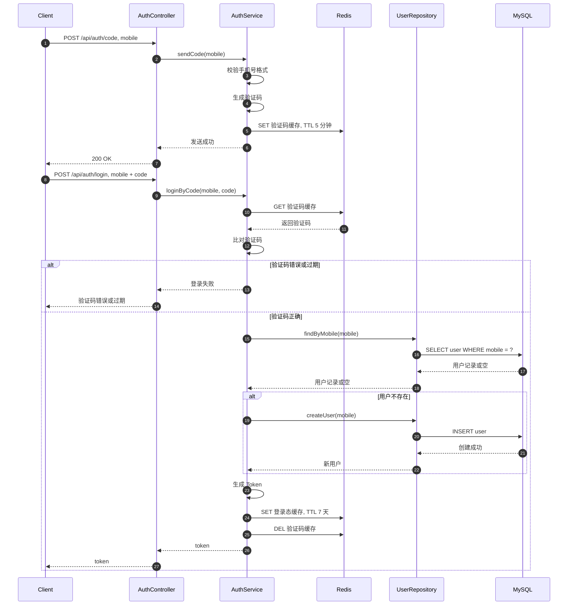
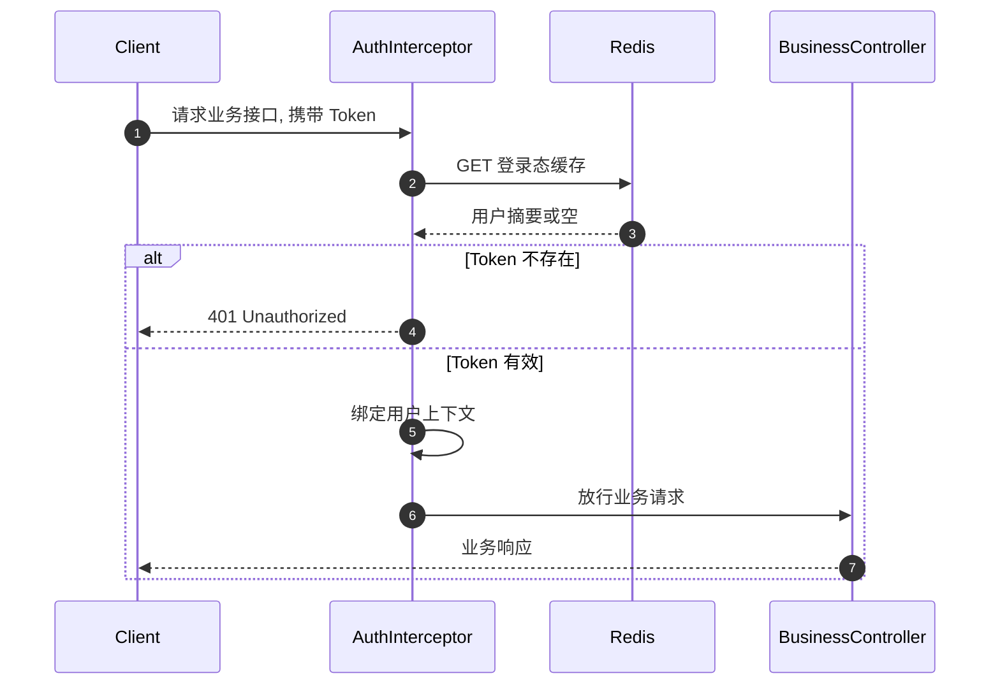
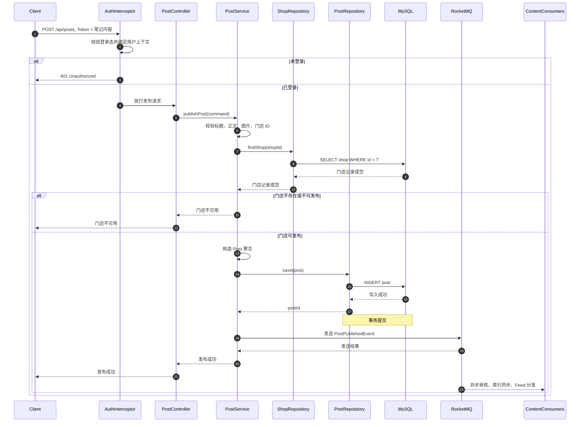
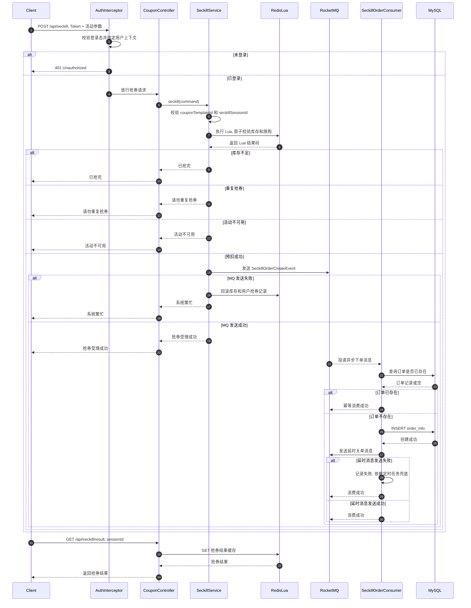
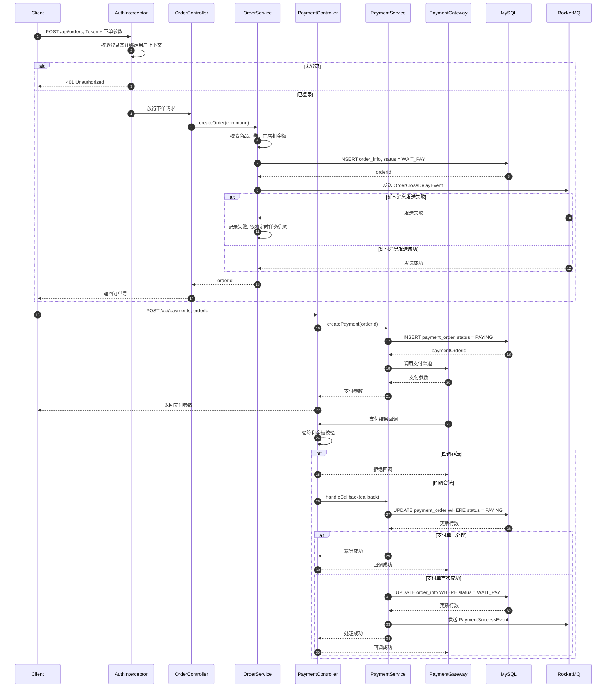
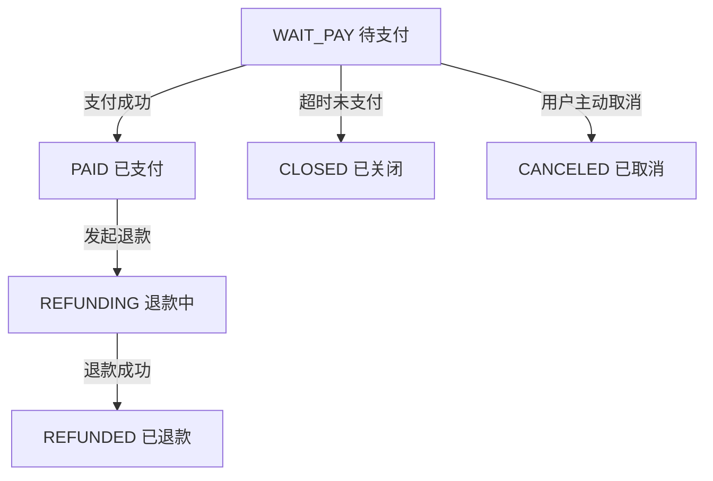
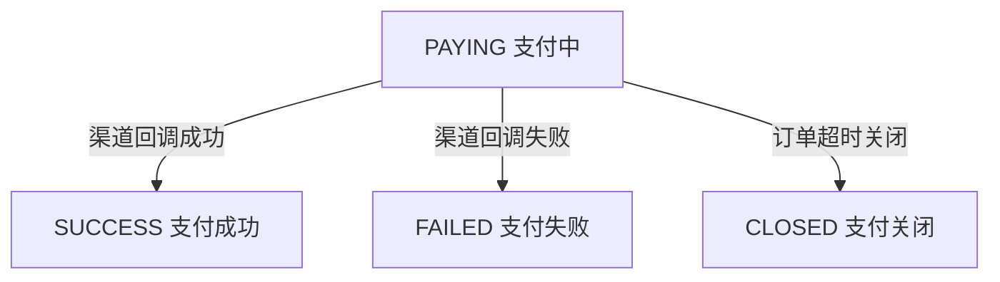

# 核心时序图文档

## 1. 文档目标

本文档描述 `LocalLife` 第一阶段的核心业务链路，重点说明请求进入系统后，Controller、Service、MySQL、Redis、MQ 等组件如何协同。

第一批核心链路：

1. 登录链路
2. 发笔记链路
3. 抢券链路
4. 下单支付链路

当前已完成登录链路、发笔记链路、抢券链路和下单支付链路。

## 2. 登录链路

### 2.1 场景定义

第一阶段采用手机号验证码登录。

登录链路承担两个目标：

1. 验证用户身份，生成可用于后续请求的登录凭证。
2. 将用户基础信息持久化到 MySQL，并将登录态放入 Redis。

### 2.2 参与组件

| 组件 | 职责 |
| --- | --- |
| Client | 发起获取验证码、提交验证码、携带 Token 访问接口 |
| AuthController | 接收登录相关 HTTP 请求，做基础参数校验 |
| AuthService | 执行业务规则，生成验证码、校验验证码、生成 Token |
| UserRepository | 访问 `user` 表，查询或创建用户 |
| Redis | 存放验证码和登录态 |
| MySQL | 存放用户长期数据 |

### 2.3 核心数据

| 数据 | 存储位置 | 说明 |
| --- | --- | --- |
| 手机号 | MySQL `user.mobile` | 用户登录唯一标识 |
| 验证码 | Redis `login:code:{mobile}` | 短期有效，默认 5 分钟 |
| Token | Redis `login:token:{token}` | 登录态凭证，默认 7 天 |
| 用户基础信息 | MySQL `user` | 用户长期主数据 |

### 2.4 时序图



### 2.5 主流程拆解

1. 用户输入手机号，请求发送验证码。
2. 后端校验手机号格式，生成验证码。
3. 验证码写入 Redis，设置短 TTL。
4. 用户提交手机号和验证码。
5. 后端从 Redis 读取验证码并比对。
6. 验证通过后，根据手机号查询 MySQL。
7. 用户存在则直接生成 Token。
8. 用户不存在则创建用户，再生成 Token。
9. Token 对应的用户摘要写入 Redis。
10. 删除验证码，避免重复使用。

### 2.6 后续请求鉴权流程



### 2.7 MySQL 与 Redis 分工

| 组件 | 承担内容 | 原因 |
| --- | --- | --- |
| MySQL | 用户长期数据、唯一约束、账号状态 | 数据需要可靠持久化 |
| Redis | 验证码、登录态、短期会话数据 | 读写频繁，有 TTL 需求 |

关键原则：

1. 用户是否存在，以 MySQL 为准。
2. 用户是否已登录，以 Redis Token 为准。
3. 验证码只在 Redis 保存，不落 MySQL。
4. Token 失效后，用户数据仍然保留在 MySQL。

### 2.8 表与索引依赖

涉及表：`user`

关键字段：

| 字段 | 用途 |
| --- | --- |
| `id` | 用户主键 |
| `mobile` | 登录唯一标识 |
| `nickname` | 展示名称 |
| `status` | 判断账号是否可用 |
| `created_at` | 用户创建时间 |
| `updated_at` | 用户更新时间 |

关键约束：

```sql
UNIQUE KEY uk_user_mobile (mobile)
```

该唯一约束用于保证同一个手机号只创建一个用户。并发登录时，即使多个请求同时判断用户不存在，数据库也能兜底防止重复用户。

### 2.9 Redis Key 设计

| Key | Value | TTL | 说明 |
| --- | --- | --- | --- |
| `login:code:{mobile}` | 验证码 | 5 分钟 | 手机号验证码 |
| `login:token:{token}` | 用户摘要 JSON | 7 天 | 登录态 |

用户摘要只存放高频使用的小字段，例如：

```json
{
  "userId": 10001,
  "mobile": "13800138000",
  "nickname": "user_10001",
  "status": 1
}
```

不把完整用户对象放入 Redis，避免字段膨胀、隐私泄露和缓存结构难以演进。

### 2.10 异常处理

| 异常 | 处理 |
| --- | --- |
| 手机号格式错误 | 返回参数错误 |
| 验证码不存在 | 返回验证码过期 |
| 验证码不匹配 | 返回验证码错误 |
| 用户被禁用 | 返回账号不可用 |
| Redis 写验证码失败 | 返回系统繁忙 |
| Redis 读取 Token 失败 | 登录态校验失败，返回 401 或系统繁忙 |
| MySQL 创建用户冲突 | 重新按手机号查询用户 |

登录场景对安全性要求高。Redis 不可用时，不做本地放行，也不自动绕过验证码校验。

### 2.11 工程注意点

1. 验证码成功使用后必须删除。
2. Token 不能写入业务日志。
3. 验证码不能写入业务日志。
4. 登录接口需要限流，防止短信接口和 Redis 被刷。
5. 短信验证码需要做频控：同一手机号 60 秒内最多发送 1 次，同一手机号 1 小时最多发送 5 次，同一 IP 1 小时最多发送 30 次。
6. 频控计数优先放 Redis，Key 可设计为 `login:sms:mobile:{mobile}` 和 `login:sms:ip:{ip}`。
7. 创建用户依赖 `mobile` 唯一索引兜底。
8. Redis 中只保存登录态摘要，避免缓存对象过大。
9. 后续可增加 Token 续期逻辑，先不放入第一阶段。

### 2.12 面试深挖点

| 问题 | 回答方向 |
| --- | --- |
| 为什么验证码放 Redis | 验证码是短期数据，有 TTL 需求，访问频繁，不需要长期持久化 |
| 为什么用户数据放 MySQL | 用户是主数据，需要事务、唯一约束和可靠持久化 |
| Redis 挂了登录还能不能放行 | 不能直接放行，验证码和登录态校验依赖 Redis，安全优先 |
| 并发首次登录会不会创建重复用户 | 业务层先查，数据库唯一索引兜底，冲突后重新查询 |
| Token 为什么存 Redis | 后续接口高频鉴权，Redis 读性能高，并且天然支持过期 |
| 短信验证码如何防刷 | 手机号、IP、设备维度限流，必要时接入图形验证码或滑块验证 |

## 3. 发笔记链路

### 3.1 场景定义

用户发布探店笔记，系统写入内容主表，并为后续内容审核、搜索索引、Feed 分发预留事件。

### 3.2 参与组件

| 组件 | 职责 |
| --- | --- |
| Client | 提交标题、正文、图片、门店 ID |
| PostController | 接收发布请求 |
| PostService | 校验用户、门店和内容规则 |
| ShopRepository | 校验门店是否存在、是否营业 |
| PostRepository | 写入 `post` 表 |
| Redis | 保存计数、热点内容缓存、用户维度草稿限制 |
| MQ | 异步触发审核、索引同步、Feed 分发 |
| MySQL | 保存笔记主数据和门店主数据 |

### 3.3 核心数据

| 数据 | 存储位置 | 说明 |
| --- | --- | --- |
| 用户 ID | 请求上下文 | 来自登录鉴权后的用户上下文 |
| 门店 ID | MySQL `shop.id` | 笔记关联门店 |
| 笔记内容 | MySQL `post` | 标题、正文、图片、状态 |
| 点赞数、收藏数、评论数 | MySQL `post` 与 Redis | MySQL 保存最终值，Redis 承接高频计数 |
| 内容事件 | MQ | 后续用于审核、搜索索引、Feed 分发 |

### 3.4 流程图



### 3.5 主流程拆解

1. 用户携带 Token 请求发布笔记。
2. 鉴权拦截器从 Redis 读取登录态。
3. 登录态有效后，Controller 接收标题、正文、图片、门店 ID。
4. Service 校验内容长度、图片数量、门店 ID。
5. 查询 MySQL `shop` 表，确认门店存在且状态可用。
6. 构造 `Post` 聚合，初始状态设置为 `PUBLISHED` 或 `PENDING_REVIEW`。
7. 写入 MySQL `post` 表。
8. 事务提交后发送内容发布事件到 MQ。
9. MQ 消费者异步处理内容审核、搜索索引同步、Feed 分发。
10. 客户端得到发布成功响应。

第一阶段可先直接写入 `PUBLISHED`，后续接入内容审核后改成 `PENDING_REVIEW -> PUBLISHED`。

### 3.6 MySQL、Redis、MQ 分工

| 组件 | 承担内容 | 原因 |
| --- | --- | --- |
| MySQL | 保存笔记、门店、用户等主数据 | 内容需要可靠持久化 |
| Redis | 承接高频计数、热点笔记缓存、发布频控 | 高频读写和限流适合放 Redis |
| MQ | 异步处理审核、索引、Feed | 发布接口要控制响应耗时，非核心动作异步化 |

关键原则：

1. 笔记是否存在，以 MySQL 为准。
2. 点赞数、收藏数、评论数可先查 MySQL，后续高频场景迁移到 Redis。
3. 搜索索引和 Feed 属于派生数据，可以接受短暂延迟。
4. MQ 发送失败不能影响 MySQL 主数据写入，但需要补偿任务兜底。

### 3.7 表与索引依赖

涉及表：`post`、`shop`、`user`

关键字段：

| 表 | 字段 | 用途 |
| --- | --- | --- |
| `post` | `id` | 笔记主键 |
| `post` | `user_id` | 发布人 |
| `post` | `shop_id` | 关联门店 |
| `post` | `title` | 标题 |
| `post` | `content` | 正文 |
| `post` | `status` | 内容状态 |
| `shop` | `id` | 门店主键 |
| `shop` | `status` | 判断门店是否可发布 |

候选索引：

```sql
KEY idx_post_user_id_created_at (user_id, created_at)
KEY idx_post_shop_id_created_at (shop_id, created_at)
KEY idx_post_status_created_at (status, created_at)
```

索引目的：

1. `idx_post_user_id_created_at` 支撑用户主页笔记列表。
2. `idx_post_shop_id_created_at` 支撑门店详情页笔记列表。
3. `idx_post_status_created_at` 支撑后台审核和内容管理。

### 3.8 Redis Key 设计

| Key | Value | TTL | 说明 |
| --- | --- | --- | --- |
| `post:detail:{postId}` | 笔记详情 JSON | 10 分钟 | 热点笔记详情缓存 |
| `post:stat:{postId}` | Hash 计数 | 无固定 TTL | 点赞数、收藏数、评论数 |
| `publish:limit:{userId}` | 发布次数 | 1 分钟 | 用户发布频控 |

第一阶段可以先不做详情缓存，只在文档中保留设计。编码阶段先完成 MySQL 主链路。

### 3.9 MQ 事件设计

事件名：`PostPublishedEvent`

建议字段：

```json
{
  "eventId": "190000000000000001",
  "postId": "180000000000000001",
  "userId": "10001",
  "shopId": "20001",
  "eventTime": "2026-05-26T20:00:00"
}
```

事件消费者：

| 消费者 | 职责 |
| --- | --- |
| ContentReviewConsumer | 内容审核 |
| SearchIndexConsumer | 同步 Elasticsearch |
| FeedDispatchConsumer | 分发关注 Feed |

第一阶段编码时可以先只保留事件结构，MQ 接入放到抢券链路之后。

### 3.10 异常处理

| 异常 | 处理 |
| --- | --- |
| 未登录 | 返回 401 |
| 标题为空或过长 | 返回参数错误 |
| 正文为空或过长 | 返回参数错误 |
| 图片数量超限 | 返回参数错误 |
| 门店不存在 | 返回门店不存在 |
| 门店已下线 | 返回门店不可用 |
| 用户发布过快 | 返回请求过于频繁 |
| MySQL 写入失败 | 返回发布失败 |
| MQ 发送失败 | 记录失败事件，后续补偿重发 |

发布接口的主结果以 MySQL 写入成功为准。MQ 失败属于派生链路失败，需要补偿机制处理。

### 3.11 工程注意点

1. 发布接口必须走登录鉴权。
2. 门店状态必须校验，避免向下线门店继续生产内容。
3. 内容状态要预留审核流转。
4. 图片上传链路后续单独设计，当前只保存图片 URL。
5. 发布成功后再发送 MQ 事件，避免消费者查不到主数据。
6. MQ 事件需要 `eventId`，用于消费者幂等。
7. 搜索索引、Feed 分发都属于异步派生链路，不能拖慢发布接口。

### 3.12 面试深挖点

| 问题 | 回答方向 |
| --- | --- |
| 为什么发布成功后再发 MQ | 先保证 MySQL 主数据提交，消费者才能查到可靠数据 |
| MQ 发送失败怎么办 | 记录失败事件或本地消息表，定时任务补偿重发 |
| 搜索索引延迟怎么办 | ES 是派生索引，允许短暂延迟，前台详情以 MySQL 为准 |
| 内容审核怎么接入 | 初始状态设为 `PENDING_REVIEW`，审核通过后流转为 `PUBLISHED` |
| 为什么计数后续放 Redis | 点赞、收藏、评论计数读写频繁，直接打 MySQL 成本高 |
| Feed 为什么异步分发 | 关注关系可能很大，同步分发会拉长发布接口耗时 |

## 4. 抢券链路

### 4.1 场景定义

用户参与优惠券秒杀，系统需要解决高并发库存扣减、重复抢券、异步下单和最终一致性。

抢券链路的核心目标：

1. 高并发请求不直接打 MySQL。
2. Redis Lua 原子完成库存预扣和用户限购校验。
3. 抢券成功后通过 MQ 异步创建订单。
4. 消费端保证幂等，避免重复下单。
5. MQ 失败、消费者失败、支付超时都有补偿路径。

### 4.2 参与组件

| 组件 | 职责 |
| --- | --- |
| Client | 发起抢券请求 |
| CouponController | 接收秒杀请求 |
| SeckillService | 执行资格校验和库存预扣 |
| Redis + Lua | 原子校验库存、活动时间、用户限购 |
| RocketMQ | 投递异步下单消息 |
| SeckillOrderConsumer | 消费抢券成功消息，创建订单 |
| MySQL | 保存券模板、秒杀场次、订单数据 |
| CompensationJob | 扫描异常记录，补偿消息或库存 |

### 4.3 核心数据

| 数据 | 存储位置 | 说明 |
| --- | --- | --- |
| 券模板 | MySQL `coupon_template` | 券的规则、库存、状态 |
| 秒杀场次 | MySQL `seckill_session` | 秒杀开始时间、结束时间、秒杀库存 |
| 秒杀库存 | Redis | 承接高并发预扣 |
| 用户抢券记录 | Redis Set | 防止同一用户重复抢 |
| 抢券成功事件 | RocketMQ | 异步创建订单 |
| 订单 | MySQL `order_info` | 最终交易单据 |

### 4.4 流程图



### 4.5 主流程拆解

1. 用户携带 Token 发起抢券请求。
2. 鉴权通过后，Controller 接收 `couponTemplateId` 和 `seckillSessionId`。
3. Service 先做轻量参数校验，不查 MySQL 库存。
4. Redis Lua 脚本一次性完成活动时间、库存、用户限购校验。
5. Lua 预扣库存成功后，服务端生成抢券消息。
6. 消息发送到 RocketMQ。
7. 接口返回“抢券受理成功”，不在同步链路里创建订单。
8. 消费者收到消息后，先按业务幂等键查询订单是否存在。
9. 订单不存在时创建 `order_info`。
10. 创建订单成功后发送延时关单消息。
11. 如果延时关单消息发送失败，消费者记录失败日志，由定时任务扫描超时订单兜底。
12. 客户端可轮询查询抢券结果，结果来源可以是 Redis 的 `seckill:result:{userId}:{sessionId}` 或订单状态。

### 4.6 Redis Key 设计

| Key | Value | TTL | 说明 |
| --- | --- | --- | --- |
| `seckill:stock:{sessionId}:{couponTemplateId}` | 库存数量 | 活动结束后 1 天 | 秒杀库存 |
| `seckill:user:{sessionId}:{couponTemplateId}` | 用户 ID Set | 活动结束后 1 天 | 已抢用户集合 |
| `seckill:session:{sessionId}` | 场次摘要 JSON | 活动结束后 1 天 | 活动开始、结束、状态 |
| `seckill:result:{userId}:{sessionId}` | 抢券结果 | 10 分钟 | 查询异步下单结果 |

Key 设计原则：

1. 秒杀库存必须提前预热到 Redis。
2. 用户限购记录放 Redis Set，Lua 内执行 `SISMEMBER` 和 `SADD`。
3. 活动结束后保留短时间 TTL，便于排查和结果查询。
4. MySQL 保留最终事实，Redis 负责高并发预扣。

### 4.7 Lua 脚本逻辑

Lua 脚本需要在 Redis 内完成原子判断，避免多个请求并发读写导致超卖。

伪代码：

```lua
local stockKey = KEYS[1]
local userKey = KEYS[2]
local userId = ARGV[1]

local stock = tonumber(redis.call('GET', stockKey))
if stock == nil then
    return 3
end

if stock <= 0 then
    return 1
end

if redis.call('SISMEMBER', userKey, userId) == 1 then
    return 2
end

redis.call('DECR', stockKey)
redis.call('SADD', userKey, userId)
return 0
```

返回码约定：

| 返回码 | 含义 | 接口处理 |
| --- | --- | --- |
| `0` | 预扣成功 | 发送 MQ 消息 |
| `1` | 库存不足 | 返回已抢完 |
| `2` | 用户重复抢券 | 返回请勿重复抢券 |
| `3` | 库存未预热或活动不可用 | 返回活动不可用 |

### 4.8 MQ 事件设计

事件名：`SeckillOrderCreateEvent`

建议字段：

```json
{
  "eventId": "190000000000000002",
  "userId": "10001",
  "couponTemplateId": "30001",
  "seckillSessionId": "40001",
  "requestId": "req_20260526_0001",
  "eventTime": "2026-05-26T20:10:00"
}
```

关键字段：

| 字段 | 用途 |
| --- | --- |
| `eventId` | 消息幂等 |
| `userId` | 用户维度限购和建单 |
| `couponTemplateId` | 识别券模板 |
| `seckillSessionId` | 识别秒杀场次 |
| `requestId` | 接口请求幂等和链路追踪 |

### 4.9 消费者幂等设计

消费者创建订单前必须先做幂等判断。

幂等键：

```text
user_id + coupon_template_id + seckill_session_id
```

数据库约束：

```sql
UNIQUE KEY uk_order_seckill_user_coupon (user_id, coupon_template_id, seckill_session_id)
```

消费流程：

1. 消费者收到 `SeckillOrderCreateEvent`。
2. 根据幂等键查询 `order_info` 是否已存在。
3. 已存在则直接返回消费成功。
4. 不存在则插入订单。
5. 插入遇到唯一键冲突时，说明其他线程已创建订单，按消费成功处理。

### 4.10 MySQL、Redis、MQ 分工

| 组件 | 承担内容 | 原因 |
| --- | --- | --- |
| Redis | 秒杀库存预扣、用户限购 | 扛高并发，Lua 保证原子性 |
| MySQL | 券模板、场次、订单最终数据 | 负责最终一致事实 |
| RocketMQ | 异步削峰、创建订单、延时关单 | 解耦抢券请求和订单创建 |

关键原则：

1. 抢券入口不直接扣 MySQL 库存。
2. Redis 预扣成功只代表抢券受理成功。
3. MySQL 订单创建成功才代表最终获得券。
4. MQ 消费失败要重试，超过阈值进入死信或补偿任务。

### 4.11 失败补偿

| 失败点 | 风险 | 处理 |
| --- | --- | --- |
| Lua 执行失败 | 无法判断库存和限购 | 返回系统繁忙 |
| Lua 成功但 MQ 发送失败 | Redis 已预扣，订单未创建 | 回滚 Redis 库存和用户 Set，记录失败日志 |
| MQ 发送成功但消费者失败 | 订单延迟创建 | RocketMQ 重试，仍失败进入死信 |
| 订单创建成功但延时关单消息失败 | 未支付订单不能自动关闭 | 定时任务扫描超时订单兜底 |
| Redis 预扣数据和 MySQL 不一致 | 少卖或结果异常 | 对账任务按订单反推库存差异 |

补偿优先级：

1. 同步可回滚的，立即回滚 Redis。
2. 同步不可确认的，写失败记录。
3. 异步失败的，交给 MQ 重试和死信。
4. 最终不一致的，用对账任务修复。

### 4.12 异常处理

| 异常 | 处理 |
| --- | --- |
| 未登录 | 返回 401 |
| 活动未开始 | 返回活动未开始 |
| 活动已结束 | 返回活动已结束 |
| 库存不足 | 返回已抢完 |
| 重复抢券 | 返回请勿重复抢券 |
| Redis 不可用 | 返回系统繁忙，抢券入口降级 |
| MQ 不可用 | 回滚 Redis 预扣，返回系统繁忙 |
| 消费者重复消费 | 唯一索引和业务幂等兜底 |

Redis 不可用时不能切到 MySQL 扣库存。高并发抢券场景下直接打 MySQL 会引发数据库雪崩。

### 4.13 工程注意点

1. 秒杀库存必须提前预热到 Redis。
2. Redis Lua 脚本必须同时处理库存和限购。
3. 接口返回“受理成功”，最终结果通过订单查询确认。
4. MQ 消息必须携带 `eventId` 和 `requestId`。
5. 消费者必须做幂等，不能依赖 MQ 只投递一次。
6. 数据库唯一索引是最后一道幂等防线。
7. MQ 发送失败时要回滚 Redis 预扣。
8. 订单超时关闭依赖延时消息，定时任务兜底。
9. 秒杀接口需要限流，后续接入 Sentinel 热点参数限流。

### 4.14 面试深挖点

| 问题 | 回答方向 |
| --- | --- |
| 为什么用 Redis Lua | 库存扣减和用户限购需要原子执行，避免并发超卖和重复抢 |
| 为什么不直接扣 MySQL 库存 | 高并发写 MySQL 会产生锁竞争，数据库承压过大 |
| Lua 成功但 MQ 失败怎么办 | 立即回滚 Redis 库存和用户 Set，并记录失败日志 |
| 消费者重复消费怎么办 | 业务幂等查询加数据库唯一索引兜底 |
| 用户怎么知道最终结果 | 接口返回受理成功，客户端查询抢券结果或订单状态 |
| 为什么需要延时关单 | 抢到券后可能不支付，需要释放业务资源并关闭订单 |
| Redis 挂了能不能走数据库 | 不能，抢券入口应降级返回系统繁忙，保护 MySQL |

## 5. 下单支付链路

### 5.1 场景定义

用户提交订单并发起支付，系统维护订单单据、支付单据、状态流转和超时关闭。

下单支付链路承担三个目标：

1. 创建业务订单，锁定商品、券或服务资源。
2. 创建支付单，承接第三方支付渠道的资金状态。
3. 处理支付回调、超时关单、退款和对账补偿。

订单是业务单据，描述用户买了什么、应付多少钱、当前交易状态。支付单是资金单据，描述这笔订单通过哪个支付渠道付款、支付渠道流水号是什么、资金状态是否成功。

### 5.2 参与组件

| 组件 | 职责 |
| --- | --- |
| Client | 提交订单、发起支付 |
| OrderController | 接收下单请求 |
| OrderService | 创建订单和锁定业务资源 |
| PaymentController | 接收发起支付请求和支付回调 |
| PaymentService | 创建支付单、调用支付渠道、处理支付回调 |
| PaymentGateway | 第三方支付渠道抽象 |
| MySQL | 保存订单、支付单、状态流转 |
| RocketMQ | 处理超时关单、支付结果通知、对账补偿 |
| ReconcileJob | 定时对账，修复异常支付状态 |

### 5.3 核心数据

| 数据 | 存储位置 | 说明 |
| --- | --- | --- |
| 订单 | MySQL `order_info` | 业务交易单据 |
| 支付单 | MySQL `payment_order` | 资金交易单据 |
| 支付渠道流水号 | MySQL `payment_order.channel_trade_no` | 第三方支付平台返回 |
| 订单超时消息 | RocketMQ | 到期未支付自动关单 |
| 支付成功事件 | RocketMQ | 通知订单状态流转和后续履约 |
| 对账结果 | MySQL 或日志 | 修复本地状态和渠道状态不一致 |

### 5.4 流程图



### 5.5 主流程拆解

1. 用户携带 Token 提交订单。
2. OrderService 校验门店、商品、券、金额和用户资格。
3. MySQL 创建 `order_info`，状态为 `WAIT_PAY`。
4. 发送延时关单消息，例如 30 分钟后检查订单是否仍未支付。
5. 如果延时关单消息发送失败，记录失败日志，由定时任务扫描 `WAIT_PAY` 且已过期的订单兜底。
6. 返回订单号。
7. 用户基于订单号发起支付。
8. PaymentService 创建 `payment_order`，状态为 `PAYING`。
9. 系统调用第三方支付渠道，拿到支付参数。
10. 支付渠道异步回调系统。
11. 系统验签并校验回调金额、订单号、支付渠道流水号。
12. 支付回调幂等处理，避免重复回调导致重复更新。
13. 更新支付单为 `SUCCESS`，更新订单为 `PAID`。
14. 发送支付成功事件，后续触发券核销、通知、履约等动作。

### 5.6 订单和支付单边界

| 对象 | 关注点 | 示例字段 |
| --- | --- | --- |
| `order_info` | 业务交易 | 用户、门店、商品、优惠券、应付金额、订单状态 |
| `payment_order` | 资金交易 | 支付渠道、支付金额、渠道流水号、支付状态 |

设计原则：

1. 一个订单可以对应一次或多次支付尝试。
2. 支付成功的支付单只能有一条。
3. 订单状态由业务规则控制，支付单状态由资金结果控制。
4. 支付渠道回调先落支付单，再推动订单状态流转。

### 5.7 订单状态机

订单状态：

| 状态 | 含义 |
| --- | --- |
| `WAIT_PAY` | 待支付 |
| `PAID` | 已支付 |
| `CANCELED` | 已取消 |
| `REFUNDING` | 退款中 |
| `REFUNDED` | 已退款 |
| `CLOSED` | 已关闭 |

状态流转图：



非法流转处理：

| 当前状态 | 收到事件 | 处理 |
| --- | --- | --- |
| `PAID` | 再次支付成功回调 | 幂等返回成功 |
| `CLOSED` | 支付成功回调 | 查询渠道真实支付结果，必要时发起退款或人工补偿 |
| `REFUNDED` | 支付成功回调 | 记录异常并进入对账 |
| `CANCELED` | 超时关单消息 | 幂等忽略 |

### 5.8 支付单状态机

支付单状态：

| 状态 | 含义 |
| --- | --- |
| `PAYING` | 支付中 |
| `SUCCESS` | 支付成功 |
| `FAILED` | 支付失败 |
| `CLOSED` | 支付关闭 |

状态流转图：



### 5.9 表与索引依赖

涉及表：`order_info`、`payment_order`

关键字段：

| 表 | 字段 | 用途 |
| --- | --- | --- |
| `order_info` | `id` | 订单主键 |
| `order_info` | `user_id` | 用户维度查单 |
| `order_info` | `status` | 订单状态机 |
| `order_info` | `pay_amount` | 应付金额 |
| `order_info` | `expire_time` | 超时关单时间 |
| `payment_order` | `id` | 支付单主键 |
| `payment_order` | `order_id` | 关联订单 |
| `payment_order` | `channel` | 支付渠道 |
| `payment_order` | `channel_trade_no` | 渠道流水号 |
| `payment_order` | `status` | 支付状态 |

候选索引：

```sql
KEY idx_order_user_id_created_at (user_id, created_at)
KEY idx_order_status_expire_time (status, expire_time)
UNIQUE KEY uk_payment_channel_trade_no (channel, channel_trade_no)
KEY idx_payment_order_id (order_id)
```

索引目的：

1. `idx_order_user_id_created_at` 支撑用户订单列表。
2. `idx_order_status_expire_time` 支撑超时关单扫描兜底。
3. `uk_payment_channel_trade_no` 防止同一渠道流水重复入账。
4. `idx_payment_order_id` 支撑按订单查询支付单。

### 5.10 MQ 事件设计

#### 5.10.1 延时关单事件

事件名：`OrderCloseDelayEvent`

```json
{
  "eventId": "190000000000000003",
  "orderId": "50001",
  "userId": "10001",
  "expireTime": "2026-05-26T20:40:00"
}
```

消费逻辑：

1. 消费者收到延时消息。
2. 查询订单当前状态。
3. 状态仍为 `WAIT_PAY` 时，将订单改为 `CLOSED`。
4. 状态已为 `PAID`、`CANCELED`、`REFUNDED` 时，直接幂等忽略。

#### 5.10.2 支付成功事件

事件名：`PaymentSuccessEvent`

```json
{
  "eventId": "190000000000000004",
  "orderId": "50001",
  "paymentOrderId": "60001",
  "channel": "mock_pay",
  "channelTradeNo": "pay_20260526_0001",
  "paidAmount": 9900,
  "eventTime": "2026-05-26T20:12:00"
}
```

消费逻辑：

1. 通知业务履约。
2. 更新券使用状态。
3. 触发站内通知。
4. 写入后续对账所需的事件日志。

### 5.11 支付回调幂等

支付渠道可能重复回调。系统必须把回调设计成幂等。

幂等依据：

1. 渠道流水号唯一。
2. 支付单状态只允许从 `PAYING` 流转到 `SUCCESS`。
3. 订单状态只允许从 `WAIT_PAY` 流转到 `PAID`。

核心 SQL 思路：

```sql
UPDATE payment_order
SET status = 'SUCCESS'
WHERE id = ?
  AND status = 'PAYING';
```

```sql
UPDATE order_info
SET status = 'PAID'
WHERE id = ?
  AND status = 'WAIT_PAY';
```

如果更新行数为 0，说明状态已经被其他请求处理过，需要查询当前状态后按幂等结果返回。

### 5.12 超时关单

超时关单采用“延时消息为主，定时任务兜底”。

主链路：

1. 订单创建后发送 30 分钟延时消息。
2. 延时消息触发后检查订单状态。
3. 订单仍为 `WAIT_PAY` 时关闭订单。
4. 订单已支付时忽略消息。

兜底链路：

1. 定时任务扫描 `WAIT_PAY` 且 `expire_time < now()` 的订单。
2. 分批关闭超时订单。
3. 每批控制数量，避免扫描任务打爆数据库。

### 5.13 对账补偿

对账用于处理本地订单状态和支付渠道状态不一致。

常见不一致：

| 本地状态 | 渠道状态 | 处理 |
| --- | --- | --- |
| `WAIT_PAY` | 支付成功 | 补记支付成功，更新订单为 `PAID` |
| `CLOSED` | 支付成功 | 按业务规则发起退款或转人工补偿 |
| `PAID` | 渠道无成功记录 | 标记异常，人工核查 |
| 支付单不存在 | 渠道成功 | 补建支付单并更新订单 |

对账任务原则：

1. 先以支付渠道结果为资金事实。
2. 再修复本地支付单。
3. 最后推动订单状态。
4. 所有修复动作必须幂等。

### 5.14 异常处理

| 异常 | 处理 |
| --- | --- |
| 未登录 | 返回 401 |
| 商品或券不可用 | 返回资源不可用 |
| 金额校验失败 | 拒绝下单 |
| 重复提交订单 | 依赖请求幂等键或业务唯一约束 |
| 支付渠道调用失败 | 支付单保留 `PAYING` 或标记 `FAILED` |
| 支付回调验签失败 | 拒绝回调 |
| 支付回调重复 | 幂等返回成功 |
| 支付成功但订单已关闭 | 进入对账或退款补偿 |
| 延时关单消息重复 | 状态机幂等忽略 |

### 5.15 工程注意点

1. 下单接口要做请求幂等，避免用户重复点击创建多个订单。
2. 创建订单和创建支付单分开，便于支持多支付渠道和多次支付尝试。
3. 支付回调必须验签。
4. 回调金额必须和本地订单金额一致。
5. 状态更新必须带原状态条件，避免非法流转。
6. 延时关单必须二次查询订单状态。
7. 支付成功事件需要 `eventId`，消费者按事件幂等。
8. 对账任务不能直接覆盖状态，必须记录修复原因和修复前后状态。

### 5.16 面试深挖点

| 问题 | 回答方向 |
| --- | --- |
| 订单和支付单有什么区别 | 订单描述业务交易，支付单描述资金交易 |
| 为什么支付回调要幂等 | 支付渠道可能重复通知，网络重试也会导致重复回调 |
| 支付成功但订单已关闭怎么办 | 查询渠道事实，按业务规则退款或补偿，不能简单忽略 |
| 为什么关单用延时消息 | 避免高频扫表，延时消息更贴合订单粒度 |
| 延时消息丢了怎么办 | 定时任务扫描超时订单兜底 |
| 状态机怎么防非法流转 | 更新 SQL 带原状态条件，更新失败后查询当前状态判断 |
| 为什么需要对账 | 本地系统和支付渠道之间存在网络、回调、重试导致的不一致 |
