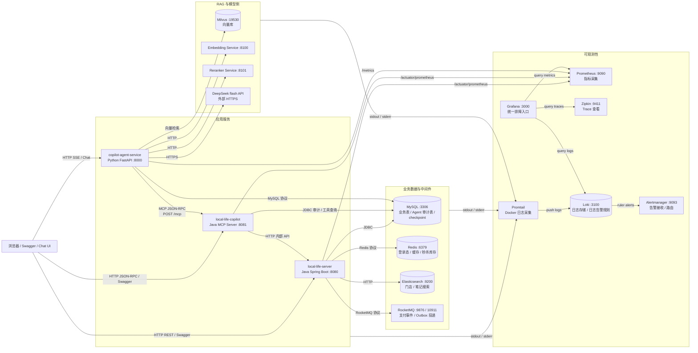
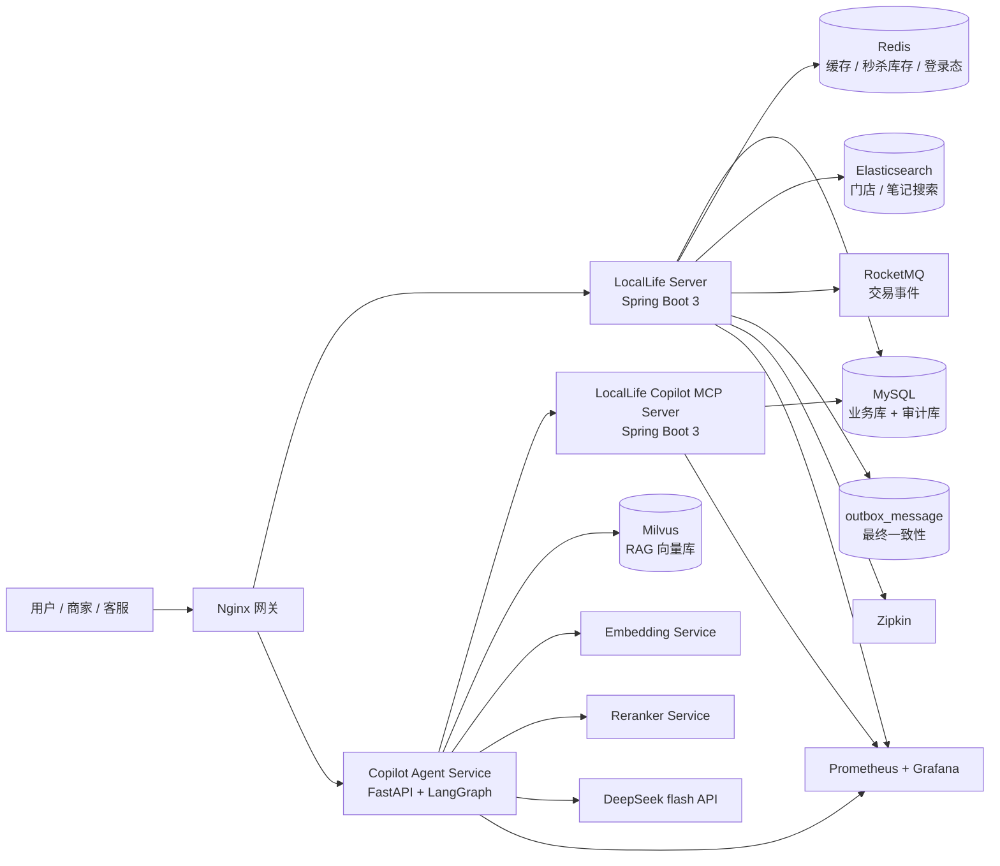
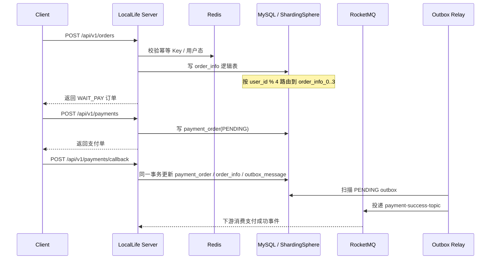
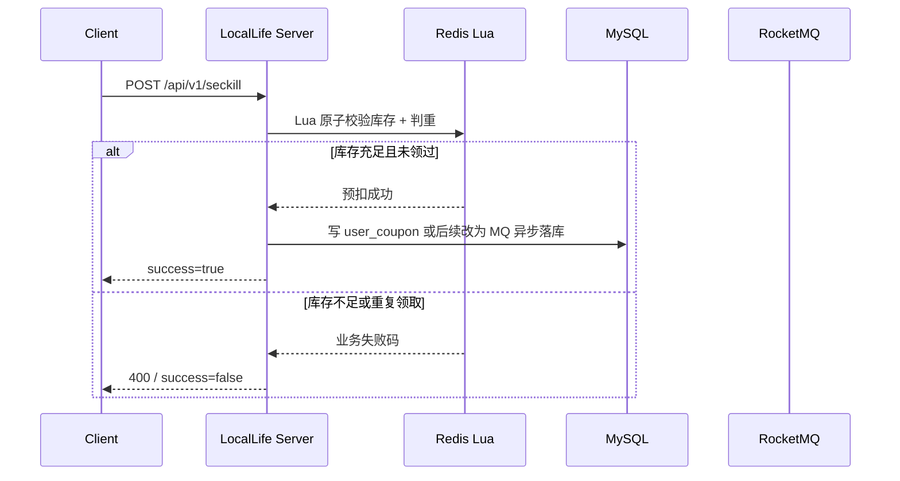
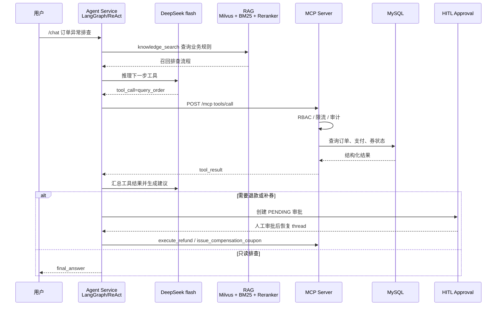

# 后端链路与 Agent 链路架构图

本文给面试、交接和设计评审使用，重点展示 LocalLife 如何把传统后端能力安全地提供给 AI Agent。

## 0. 当前本地 Docker Compose 组件关系

这张图按当前本地容器的真实边界来画：每个方框基本对应一个独立服务或基础设施组件。服务之间不是直接调用对方代码，而是通过 HTTP、MCP JSON-RPC、数据库协议、Redis 协议、MQ 协议或日志采集链路通信。

读这张图时重点抓四条线：

| 链路 | 说明 |
| --- | --- |
| 用户业务链路 | 浏览器直接访问 `local-life-server`，查/改真实业务数据。 |
| Agent 工具链路 | 浏览器访问 Python Agent，Agent 通过 MCP 调 Java MCP Server，再由 MCP Server 查业务系统。 |
| RAG 链路 | Agent 访问 Milvus、Embedding、Reranker 和 DeepSeek flash，用于知识检索和回答生成。 |
| 排障链路 | 各容器输出日志到 stdout，Promtail 采集到 Loki，Grafana 查询日志、指标和 trace，Alertmanager 接收日志告警。 |

## 1. 总体架构

## 2. 后端交易链路

讲解重点：

- 订单写入走逻辑表 `order_info`，ShardingSphere 路由到 4 张物理表。
- 支付回调使用唯一索引和状态机保证幂等。
- DB 事务只覆盖业务表和 outbox 表，MQ 发送由 Relay 异步完成。
- MQ 临时不可用时消息留在 outbox，避免“支付成功但事件丢失”。

## 3. 秒杀链路

讲解重点：

- Lua 将“查库存、扣库存、写用户集合”合成一次原子操作。
- `user_coupon` 唯一索引是最终兜底。
- 压测验收只看系统是否超卖，不把售罄、重复领取、限流当系统错误。

## 4. Agent 工具调用链路

讲解重点：

- Agent 不直接操作数据库，所有业务能力通过 MCP 工具暴露。
- MCP Server 是安全边界：RBAC、审计、限流、结构化错误都在这里收敛。
- RAG 负责提供业务规则和排查 SOP，避免 LLM 编造流程。
- HITL 让高风险动作先挂起，人工审批后再恢复执行。

## 5. 面试答辩抓手

| 方向 | 可以强调 |
| --- | --- |
| 后端能力 | 分片、缓存、搜索、MQ、outbox、幂等、限流、可观测性。 |
| Agent 能力 | LangGraph/ReAct、MCP 工具、Tool Router、RAG、HITL、会话持久化。 |
| 工程能力 | Docker Compose、本地 smoke、CI 质量门禁、Swagger、压测脚本。 |
| 上线意识 | Secret 管理、灰度发布、生产关闭 Swagger、告警与回滚预案。 |
