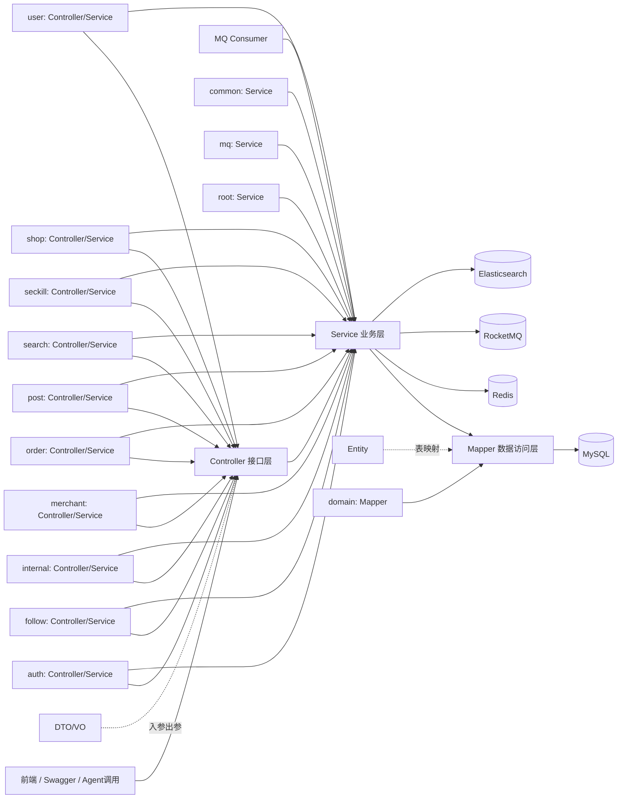

# LocalLife Server 代码关系图

> 本文档由 `python3 ../local-life-tools/code-analysis/java_code_graph.py` 自动生成。它用于学习 `local-life-server` 的接口入口、类依赖和方法调用关系。

## 1. 当前扫描结果

- Java 文件数：110
- 显式方法数：206
- HTTP 接口数：42
- 角色分布：Advice=5，Common=8，Config=7，Controller=11，DTO=25，Entity=12，Mapper=12，Other=10，Service=20
- 源码目录：`local-life-server/src/main/java`

## 2. 怎么读这份图

从上往下看：HTTP 请求先进入 Controller，Controller 只做参数接收和响应包装；真正的业务规则在 Service；Mapper 负责 MySQL；Redis/RocketMQ/ES 是 Service 旁路依赖。面试时不要只背接口，要能沿着 `接口 -> Controller -> Service -> Mapper/中间件 -> 数据一致性` 讲完整链路。

## 3. 服务分层总览



## 4. Controller/Service/Mapper 调用图

这张图来自源码里的字段依赖和 `xxx.yyy()` 调用，适合快速看哪些类在协作。

```mermaid
flowchart LR
  LocalLifeServerApplication["[S] LocalLifeServerApplication"]
  BloomFilterService["[S] BloomFilterService"]
  CommentMapper["[M] CommentMapper"]
  CouponTemplateMapper["[M] CouponTemplateMapper"]
  FollowRelationMapper["[M] FollowRelationMapper"]
  MerchantMapper["[M] MerchantMapper"]
  OrderInfoMapper["[M] OrderInfoMapper"]
  OutboxMessageMapper["[M] OutboxMessageMapper"]
  PaymentOrderMapper["[M] PaymentOrderMapper"]
  PostMapper["[M] PostMapper"]
  SeckillSessionMapper["[M] SeckillSessionMapper"]
  ShopMapper["[M] ShopMapper"]
  UserCouponMapper["[M] UserCouponMapper"]
  UserMapper["[M] UserMapper"]
  AuthController["[C] AuthController"]
  AuthService["[S] AuthService"]
  FollowController["[C] FollowController"]
  FollowService["[S] FollowService"]
  InternalController["[C] InternalController"]
  InternalService["[S] InternalService"]
  MerchantController["[C] MerchantController"]
  MerchantService["[S] MerchantService"]
  OrderCloseConsumer["[S] OrderCloseConsumer"]
  PaymentSuccessConsumer["[S] PaymentSuccessConsumer"]
  SeckillSuccessConsumer["[S] SeckillSuccessConsumer"]
  OutboxService["[S] OutboxService"]
  OrderController["[C] OrderController"]
  PaymentController["[C] PaymentController"]
  OrderService["[S] OrderService"]
  PaymentService["[S] PaymentService"]
  PostController["[C] PostController"]
  PostService["[S] PostService"]
  SearchController["[C] SearchController"]
  PostSearchService["[S] PostSearchService"]
  ShopSearchService["[S] ShopSearchService"]
  SeckillController["[C] SeckillController"]
  CouponService["[S] CouponService"]
  SeckillService["[S] SeckillService"]
  ShopController["[C] ShopController"]
  ShopCacheService["[S] ShopCacheService"]
  ShopService["[S] ShopService"]
  UserController["[C] UserController"]
  UserService["[S] UserService"]
  AuthController -->|login| AuthService
  AuthController -->|logout| AuthService
  AuthController -->|sendCode| AuthService
  AuthService -->|checkSmsLimit| AuthService
  AuthService -->|desensitizeMobile| AuthService
  AuthService -->|generateAndStoreToken| AuthService
  AuthService -->|getOrRegister| AuthService
  AuthService -->|incrementSmsCount| AuthService
  AuthService -->|registerNewUser| AuthService
  AuthService -->|verifyCode| AuthService
  AuthService -->|insert| UserMapper
  AuthService -->|selectOne| UserMapper
  AuthService -->|updateById| UserMapper
  BloomFilterService -->|loadExistingShopIds| BloomFilterService
  BloomFilterService -->|selectList| ShopMapper
  CouponService -->|selectList| CouponTemplateMapper
  CouponService -->|selectList| SeckillSessionMapper
  CouponService -->|selectBatchIds| ShopMapper
  FollowController -->|follow| FollowService
  FollowController -->|getCommonFollows| FollowService
  FollowController -->|isFollowing| FollowService
  FollowController -->|unfollow| FollowService
  FollowService -->|delete| FollowRelationMapper
  FollowService -->|insert| FollowRelationMapper
  FollowService -->|selectList| FollowRelationMapper
  FollowService -->|ensureFollowSetLoaded| FollowService
  FollowService -->|selectBatchIds| UserMapper
  FollowService -->|selectById| UserMapper
  InternalController -->|verifyInternalKey| InternalController
  InternalController -->|executeRefund| InternalService
  InternalController -->|issueCompensationCoupon| InternalService
  InternalService -->|selectOne| OrderInfoMapper
  InternalService -->|update| OrderInfoMapper
  MerchantController -->|apply| MerchantService
  MerchantController -->|getMyMerchant| MerchantService
  MerchantController -->|listMyShops| ShopService
  MerchantService -->|insert| MerchantMapper
  MerchantService -->|selectOne| MerchantMapper
  MerchantService -->|desensitizeMobile| MerchantService
  MerchantService -->|requireMerchantByUserId| MerchantService
  MerchantService -->|toVO| MerchantService
  OrderCloseConsumer -->|handleOrderCloseDelayMessage| OrderService
  OrderController -->|cancelOrder| OrderService
  OrderController -->|createOrder| OrderService
  OrderController -->|getOrderDetail| OrderService
  OrderController -->|listMyOrders| OrderService
  OrderService -->|recordOrderCreated| BusinessMetrics
  OrderService -->|selectById| CouponTemplateMapper
  OrderService -->|insert| OrderInfoMapper
  OrderService -->|markAsPaid| OrderInfoMapper
  OrderService -->|selectById| OrderInfoMapper
  OrderService -->|selectList| OrderInfoMapper
  OrderService -->|selectOne| OrderInfoMapper
  OrderService -->|update| OrderInfoMapper
  OrderService -->|updateStatusFromWaitPay| OrderInfoMapper
  OrderService -->|afterCommit| OrderService
  OrderService -->|closeOrderIfExpired| OrderService
  OrderService -->|publishOrderCloseDelayMessage| OrderService
  OrderService -->|registerOrderCloseDelayMessageAfterCommit| OrderService
  OrderService -->|toVO| OrderService
  OrderService -->|selectById| ShopMapper
  OrderService -->|selectOne| UserCouponMapper
  OrderService -->|update| UserCouponMapper
  OutboxService -->|insert| OutboxMessageMapper
  OutboxService -->|markAsRetry| OutboxMessageMapper
  OutboxService -->|markAsSent| OutboxMessageMapper
  OutboxService -->|resetFailedMessageForAutoRecovery| OutboxMessageMapper
  OutboxService -->|selectList| OutboxMessageMapper
  OutboxService -->|handleSendFailure| OutboxService
  PaymentController -->|createPayment| PaymentService
  PaymentController -->|handleCallback| PaymentService
  PaymentController -->|triggerMockPay| PaymentService
  PaymentService -->|recordPaymentCallback| BusinessMetrics
  PaymentService -->|recordPaymentSuccess| BusinessMetrics
  PaymentService -->|getOrderById| OrderService
  PaymentService -->|markOrderAsPaid| OrderService
  PaymentService -->|saveToOutbox| OutboxService
  PaymentService -->|insert| PaymentOrderMapper
  PaymentService -->|selectByPaymentNo| PaymentOrderMapper
  PaymentService -->|update| PaymentOrderMapper
  PaymentService -->|updateStatusOnSuccess| PaymentOrderMapper
  PaymentService -->|buildCallbackBodyJson| PaymentService
  PaymentService -->|buildPayUrl| PaymentService
  PaymentService -->|handleCallback| PaymentService
  PaymentService -->|verifySign| PaymentService
  PaymentSuccessConsumer -->|processPaymentSuccess| PaymentSuccessConsumer
  PostController -->|addComment| PostService
  PostController -->|deleteComment| PostService
  PostController -->|deletePost| PostService
  PostController -->|getPostDetail| PostService
  PostController -->|likePost| PostService
  PostController -->|listComments| PostService
  PostController -->|listPostsByShop| PostService
  PostController -->|publishPost| PostService
  PostController -->|unlikePost| PostService
  PostSearchService -->|deleteById| PostSearchRepository
  PostSearchService -->|findById| PostSearchRepository
  PostSearchService -->|save| PostSearchRepository
  PostSearchService -->|boostByPopularity| PostSearchService
  PostSearchService -->|buildSort| PostSearchService
  PostSearchService -->|postToDocument| PostSearchService
  PostSearchService -->|toSearchVO| PostSearchService
  PostService -->|deleteById| CommentMapper
  PostService -->|insert| CommentMapper
  PostService -->|selectById| CommentMapper
  PostService -->|selectList| CommentMapper
  PostService -->|deleteById| PostMapper
  PostService -->|insert| PostMapper
  PostService -->|selectById| PostMapper
  PostService -->|selectList| PostMapper
  PostService -->|update| PostMapper
  PostService -->|removePost| PostSearchService
  PostService -->|syncPost| PostSearchService
  PostService -->|checkPublishRateLimit| PostService
  PostService -->|deserializeImages| PostService
  PostService -->|getRealTimeLikeCount| PostService
  PostService -->|isLikedByCurrentUser| PostService
  PostService -->|requirePublishedPost| PostService
  PostService -->|serializeImages| PostService
  PostService -->|toCommentVO| PostService
  PostService -->|toVO| PostService
  PostService -->|selectById| ShopMapper
  PostService -->|selectBatchIds| UserMapper
  PostService -->|selectById| UserMapper
  SearchController -->|searchPosts| PostSearchService
  SearchController -->|searchShops| ShopSearchService
  SeckillController -->|listActiveCoupons| CouponService
  SeckillController -->|doSeckill| SeckillService
  SeckillController -->|listMyCoupons| SeckillService
  SeckillController -->|querySeckillResult| SeckillService
  SeckillService -->|recordSeckillAttempt| BusinessMetrics
  SeckillService -->|recordSeckillFailure| BusinessMetrics
  SeckillService -->|recordSeckillSuccess| BusinessMetrics
  SeckillService -->|selectById| CouponTemplateMapper
  SeckillService -->|saveToOutbox| OutboxService
  SeckillService -->|publishSeckillSuccessEvent| SeckillService
  SeckillService -->|validateSession| SeckillService
  SeckillService -->|selectById| SeckillSessionMapper
  SeckillService -->|selectList| UserCouponMapper
  SeckillService -->|selectOne| UserCouponMapper
  SeckillSuccessConsumer -->|createUserCoupon| SeckillSuccessConsumer
  SeckillSuccessConsumer -->|markResultAsSuccess| SeckillSuccessConsumer
  SeckillSuccessConsumer -->|insert| UserCouponMapper
  ShopCacheService -->|cacheKey| ShopCacheService
  ShopCacheService -->|deleteShopDetail| ShopCacheService
  ShopController -->|createShop| ShopService
  ShopController -->|getShopDetail| ShopService
  ShopController -->|offlineShop| ShopService
  ShopController -->|onlineShop| ShopService
  ShopController -->|searchShops| ShopService
  ShopController -->|updateShop| ShopService
  ShopSearchService -->|recordShopSearch| BusinessMetrics
  ShopSearchService -->|deleteById| ShopSearchRepository
  ShopSearchService -->|save| ShopSearchRepository
  ShopSearchService -->|shopToDocument| ShopSearchService
  ShopService -->|addShopId| BloomFilterService
  ShopService -->|mightContainShopId| BloomFilterService
  ShopService -->|requireApprovedMerchant| MerchantService
  ShopService -->|deleteShopDetail| ShopCacheService
  ShopService -->|getShopDetail| ShopCacheService
  ShopService -->|putShopDetail| ShopCacheService
  ShopService -->|insert| ShopMapper
  ShopService -->|selectById| ShopMapper
  ShopService -->|selectList| ShopMapper
  ShopService -->|updateById| ShopMapper
  ShopService -->|syncShop| ShopSearchService
  ShopService -->|requireOwnShop| ShopService
  ShopService -->|toVO| ShopService
  UserController -->|getMyProfile| UserService
  UserController -->|getUserProfile| UserService
  UserService -->|selectById| UserMapper
  UserService -->|buildVO| UserService
  UserService -->|desensitizeMobile| UserService
  UserService -->|getUserOrThrow| UserService
```



## 5. 模块角色统计

| 模块 | Controller | Service | Mapper | Consumer | DTO | Entity | Common | Config | Other |
| --- | --- | --- | --- | --- | --- | --- | --- | --- | --- |
| auth | 1 | 1 | 0 | 0 | 2 | 0 | 0 | 0 | 0 |
| common | 0 | 1 | 0 | 0 | 0 | 0 | 8 | 0 | 0 |
| config | 0 | 0 | 0 | 0 | 0 | 0 | 0 | 7 | 0 |
| domain | 0 | 0 | 12 | 0 | 0 | 12 | 0 | 0 | 0 |
| follow | 1 | 1 | 0 | 0 | 1 | 0 | 0 | 0 | 0 |
| internal | 1 | 1 | 0 | 0 | 0 | 0 | 0 | 0 | 0 |
| merchant | 1 | 1 | 0 | 0 | 2 | 0 | 0 | 0 | 0 |
| mq | 0 | 4 | 0 | 0 | 0 | 0 | 0 | 0 | 5 |
| order | 2 | 2 | 0 | 0 | 5 | 0 | 0 | 0 | 0 |
| post | 1 | 1 | 0 | 0 | 4 | 0 | 0 | 0 | 0 |
| root | 0 | 1 | 0 | 0 | 0 | 0 | 0 | 0 | 0 |
| search | 1 | 2 | 0 | 0 | 4 | 0 | 0 | 0 | 4 |
| seckill | 1 | 2 | 0 | 0 | 3 | 0 | 0 | 0 | 0 |
| shop | 1 | 2 | 0 | 0 | 3 | 0 | 0 | 0 | 1 |
| user | 1 | 1 | 0 | 0 | 1 | 0 | 0 | 0 | 0 |

## 6. HTTP 接口入口表

每一行都可以按 `Controller 方法 -> 进入的下游方法` 去代码里继续追。

| HTTP | 路径 | Controller 方法 | 进入的下游方法 |
| --- | --- | --- | --- |
| POST | /api/v1/auth/code | AuthController.sendCode() | AuthService.sendCode() |
| POST | /api/v1/auth/login | AuthController.login() | AuthService.login() |
| POST | /api/v1/auth/logout | AuthController.logout() | AuthService.logout() |
| GET | /api/v1/coupons | SeckillController.listMyCoupons() | SeckillService.listMyCoupons() |
| GET | /api/v1/coupons/templates | SeckillController.listCouponTemplates() | CouponService.listActiveCoupons() |
| GET | /api/v1/follows/common/{userId} | FollowController.getCommonFollows() | FollowService.getCommonFollows() |
| GET | /api/v1/follows/status/{userId} | FollowController.isFollowing() | FollowService.isFollowing() |
| DELETE | /api/v1/follows/{userId} | FollowController.unfollow() | FollowService.unfollow() |
| POST | /api/v1/follows/{userId} | FollowController.follow() | FollowService.follow() |
| POST | /api/v1/merchants/apply | MerchantController.apply() | MerchantService.apply() |
| GET | /api/v1/merchants/me | MerchantController.getMyMerchant() | MerchantService.getMyMerchant() |
| GET | /api/v1/merchants/my-shops | MerchantController.listMyShops() | ShopService.listMyShops() |
| GET | /api/v1/orders | OrderController.listMyOrders() | OrderService.listMyOrders() |
| POST | /api/v1/orders | OrderController.createOrder() | OrderService.createOrder() |
| DELETE | /api/v1/orders/{orderId} | OrderController.cancelOrder() | OrderService.cancelOrder() |
| GET | /api/v1/orders/{orderId} | OrderController.getOrderDetail() | OrderService.getOrderDetail() |
| POST | /api/v1/payments | PaymentController.createPayment() | PaymentService.createPayment() |
| POST | /api/v1/payments/callback | PaymentController.handleCallback() | PaymentService.handleCallback() |
| GET | /api/v1/payments/mock-pay | PaymentController.triggerMockPay() | PaymentService.triggerMockPay() |
| POST | /api/v1/posts | PostController.publishPost() | PostService.publishPost() |
| DELETE | /api/v1/posts/{postId} | PostController.deletePost() | PostService.deletePost() |
| GET | /api/v1/posts/{postId} | PostController.getPostDetail() | PostService.getPostDetail() |
| GET | /api/v1/posts/{postId}/comments | PostController.listComments() | PostService.listComments() |
| POST | /api/v1/posts/{postId}/comments | PostController.addComment() | PostService.addComment() |
| DELETE | /api/v1/posts/{postId}/comments/{commentId} | PostController.deleteComment() | PostService.deleteComment() |
| DELETE | /api/v1/posts/{postId}/likes | PostController.unlikePost() | PostService.unlikePost() |
| POST | /api/v1/posts/{postId}/likes | PostController.likePost() | PostService.likePost() |
| GET | /api/v1/search/posts | SearchController.searchPosts() | PostSearchService.searchPosts() |
| GET | /api/v1/search/shops | SearchController.searchShops() | ShopSearchService.searchShops() |
| POST | /api/v1/seckill | SeckillController.doSeckill() | SeckillService.doSeckill() |
| GET | /api/v1/seckill/result | SeckillController.querySeckillResult() | SeckillService.querySeckillResult() |
| GET | /api/v1/shops | ShopController.searchShops() | ShopService.searchShops() |
| POST | /api/v1/shops | ShopController.createShop() | ShopService.createShop() |
| GET | /api/v1/shops/{shopId} | ShopController.getShopDetail() | ShopService.getShopDetail() |
| PUT | /api/v1/shops/{shopId} | ShopController.updateShop() | ShopService.updateShop() |
| GET | /api/v1/shops/{shopId}/posts | PostController.listPostsByShop() | PostService.listPostsByShop() |
| PUT | /api/v1/shops/{shopId}/status/offline | ShopController.offlineShop() | ShopService.offlineShop() |
| PUT | /api/v1/shops/{shopId}/status/online | ShopController.onlineShop() | ShopService.onlineShop() |
| GET | /api/v1/users/me | UserController.getMyProfile() | UserService.getMyProfile() |
| GET | /api/v1/users/{userId} | UserController.getUserProfile() | UserService.getUserProfile() |
| POST | /internal/orders/{orderNo}/compensate-coupon | InternalController.compensateCoupon() | InternalController.verifyInternalKey(), InternalService.issueCompensationCoupon() |
| POST | /internal/orders/{orderNo}/refund | InternalController.refund() | InternalController.verifyInternalKey(), InternalService.executeRefund() |

## 7. 核心方法调用索引

| 类 | 方法 | 检测到的下游调用 |
| --- | --- | --- |
| AuthInterceptor | PublicEndpoint() | - |
| AuthInterceptor | preHandle() | AuthInterceptor.extractToken(), AuthInterceptor.isPublicEndpoint(), ObjectMapper.readValue(), StringRedisTemplate.expire(), StringRedisTemplate.opsForValue() |
| AuthInterceptor | afterCompletion() | - |
| AuthInterceptor | isPublicEndpoint() | - |
| AuthInterceptor | extractToken() | - |
| GlobalExceptionHandler | handleBizException() | - |
| GlobalExceptionHandler | handleValidationException() | - |
| GlobalExceptionHandler | handleException() | - |
| RateLimitInterceptor | getRateLimitScript() | DefaultRedisScript.setResultType(), DefaultRedisScript.setScriptSource() |
| RateLimitInterceptor | preHandle() | RateLimitInterceptor.buildLimitKey(), RateLimitInterceptor.getRateLimitScript(), RateLimitInterceptor.writeRateLimitResponse(), StringRedisTemplate.execute() |
| RateLimitInterceptor | buildLimitKey() | RateLimitInterceptor.getClientIp() |
| RateLimitInterceptor | getClientIp() | - |
| RateLimitInterceptor | writeRateLimitResponse() | ObjectMapper.writeValueAsString() |
| BusinessMetrics | recordSeckillAttempt() | MeterRegistry.counter() |
| BusinessMetrics | recordSeckillSuccess() | MeterRegistry.counter() |
| BusinessMetrics | recordSeckillFailure() | MeterRegistry.counter() |
| BusinessMetrics | recordOrderCreated() | MeterRegistry.counter() |
| BusinessMetrics | recordOrderCreateFailure() | MeterRegistry.counter() |
| BusinessMetrics | recordPaymentCallback() | MeterRegistry.timer() |
| BusinessMetrics | recordPaymentSuccess() | MeterRegistry.counter() |
| BusinessMetrics | recordShopSearch() | MeterRegistry.counter() |
| PageResult | of() | - |
| Result | ok() | - |
| Result | ok() | - |
| Result | fail() | - |
| Result | fail() | - |
| TraceIdFilter | doFilter() | Tracer.currentSpan() |
| UserContext | set() | - |
| UserContext | get() | - |
| UserContext | getUserId() | UserContext.get() |
| UserContext | clear() | - |
| ElasticsearchConfig | initEsIndices() | ElasticsearchConfig.initIndex() |
| ElasticsearchConfig | initIndex() | ElasticsearchOperations.indexOps() |
| MybatisPlusConfig | mybatisPlusInterceptor() | - |
| MybatisPlusConfig | metaObjectHandler() | MybatisPlusConfig.insertFill(), MybatisPlusConfig.updateFill() |
| MybatisPlusConfig | insertFill() | - |
| MybatisPlusConfig | updateFill() | - |
| ObservabilityConfig | metricsCommonTags() | - |
| ObservabilityConfig | excludeActuatorMetrics() | - |
| OpenApiConfig | localLifeOpenAPI() | - |
| RedisConfig | redisTemplate() | - |
| RedisConfig | stringRedisTemplate() | - |
| RedissonConfig | redissonClient() | - |
| WebMvcConfig | addInterceptors() | - |
| AuthController | sendCode() | AuthService.sendCode() |
| AuthController | login() | AuthService.login() |
| AuthController | logout() | AuthService.logout() |
| FollowController | follow() | FollowService.follow() |
| FollowController | unfollow() | FollowService.unfollow() |
| FollowController | getCommonFollows() | FollowService.getCommonFollows() |
| FollowController | isFollowing() | FollowService.isFollowing() |
| InternalController | refund() | InternalController.verifyInternalKey(), InternalService.executeRefund() |
| InternalController | compensateCoupon() | InternalController.verifyInternalKey(), InternalService.issueCompensationCoupon() |
| InternalController | verifyInternalKey() | String.equals() |
| InternalController | of() | - |
| InternalController | of() | - |
| MerchantController | apply() | MerchantService.apply() |
| MerchantController | getMyMerchant() | MerchantService.getMyMerchant() |
| MerchantController | listMyShops() | ShopService.listMyShops() |
| OrderController | createOrder() | OrderService.createOrder() |
| OrderController | listMyOrders() | OrderService.listMyOrders() |
| OrderController | getOrderDetail() | OrderService.getOrderDetail() |
| OrderController | cancelOrder() | OrderService.cancelOrder() |
| PaymentController | createPayment() | PaymentService.createPayment() |
| PaymentController | handleCallback() | PaymentService.handleCallback() |
| PaymentController | triggerMockPay() | PaymentService.triggerMockPay() |
| PostController | publishPost() | PostService.publishPost() |
| PostController | getPostDetail() | PostService.getPostDetail() |
| PostController | deletePost() | PostService.deletePost() |
| PostController | likePost() | PostService.likePost() |
| PostController | unlikePost() | PostService.unlikePost() |
| PostController | listPostsByShop() | PostService.listPostsByShop() |
| PostController | addComment() | PostService.addComment() |
| PostController | listComments() | PostService.listComments() |
| PostController | deleteComment() | PostService.deleteComment() |
| SearchController | searchShops() | ShopSearchService.searchShops() |
| SearchController | searchPosts() | PostSearchService.searchPosts() |
| SeckillController | listCouponTemplates() | CouponService.listActiveCoupons() |
| SeckillController | doSeckill() | SeckillService.doSeckill() |
| SeckillController | querySeckillResult() | SeckillService.querySeckillResult() |
| SeckillController | listMyCoupons() | SeckillService.listMyCoupons() |
| ShopController | searchShops() | ShopService.searchShops() |
| ShopController | getShopDetail() | ShopService.getShopDetail() |
| ShopController | createShop() | ShopService.createShop() |
| ShopController | updateShop() | ShopService.updateShop() |
| ShopController | onlineShop() | ShopService.onlineShop() |
| ShopController | offlineShop() | ShopService.offlineShop() |
| UserController | getMyProfile() | UserService.getMyProfile() |
| UserController | getUserProfile() | UserService.getUserProfile() |
| AuthService | sendCode() | AuthService.checkSmsLimit(), AuthService.desensitizeMobile(), AuthService.incrementSmsCount(), StringRedisTemplate.opsForValue() |
| AuthService | login() | AuthService.generateAndStoreToken(), AuthService.getOrRegister(), AuthService.verifyCode() |
| AuthService | logout() | StringRedisTemplate.delete() |
| AuthService | checkSmsLimit() | AuthService.desensitizeMobile(), StringRedisTemplate.opsForValue() |
| AuthService | incrementSmsCount() | StringRedisTemplate.expire(), StringRedisTemplate.opsForValue() |
| AuthService | verifyCode() | StringRedisTemplate.delete(), StringRedisTemplate.opsForValue() |
| AuthService | getOrRegister() | AuthService.registerNewUser(), UserMapper.selectOne() |
| AuthService | registerNewUser() | AuthService.desensitizeMobile(), UserMapper.insert(), UserMapper.updateById() |
| AuthService | generateAndStoreToken() | AuthService.desensitizeMobile(), ObjectMapper.writeValueAsString(), StringRedisTemplate.opsForValue() |
| AuthService | desensitizeMobile() | - |
| BloomFilterService | init() | BloomFilterService.loadExistingShopIds(), RBloomFilter.count(), RBloomFilter.tryInit(), RedissonClient.getBloomFilter() |
| BloomFilterService | addShopId() | RBloomFilter.add() |
| BloomFilterService | mightContainShopId() | RBloomFilter.contains() |
| BloomFilterService | loadExistingShopIds() | ShopMapper.selectList() |
| FollowService | follow() | FollowRelationMapper.insert(), StringRedisTemplate.opsForZSet(), UserMapper.selectById() |
| FollowService | unfollow() | FollowRelationMapper.delete(), StringRedisTemplate.opsForZSet() |
| FollowService | isFollowing() | StringRedisTemplate.opsForZSet() |
| FollowService | getCommonFollows() | FollowService.ensureFollowSetLoaded(), StringRedisTemplate.delete(), StringRedisTemplate.opsForZSet(), UserMapper.selectBatchIds() |
| FollowService | ensureFollowSetLoaded() | FollowRelationMapper.selectList(), StringRedisTemplate.opsForZSet() |
| FollowService | toFollowUserVO() | - |
| InternalService | executeRefund() | OrderInfoMapper.selectOne(), OrderInfoMapper.update() |
| InternalService | issueCompensationCoupon() | - |
| MerchantService | apply() | MerchantMapper.insert(), MerchantMapper.selectOne(), MerchantService.toVO() |
| MerchantService | getMyMerchant() | MerchantService.requireMerchantByUserId(), MerchantService.toVO() |
| MerchantService | requireApprovedMerchant() | MerchantService.requireMerchantByUserId() |
| MerchantService | requireMerchantByUserId() | MerchantMapper.selectOne() |
| MerchantService | toVO() | MerchantService.desensitizeMobile() |
| MerchantService | desensitizeMobile() | - |
| OrderCloseConsumer | onMessage() | ObjectMapper.readValue(), OrderService.handleOrderCloseDelayMessage() |
| OutboxService | saveToOutbox() | ObjectMapper.writeValueAsString(), OutboxMessageMapper.insert() |
| OutboxService | relayMessages() | OutboxMessageMapper.markAsSent(), OutboxMessageMapper.selectList(), OutboxService.handleSendFailure(), RocketMQTemplate.syncSend() |
| OutboxService | autoRecoverFailedMessages() | OutboxMessageMapper.resetFailedMessageForAutoRecovery(), OutboxMessageMapper.selectList() |
| OutboxService | handleSendFailure() | OutboxMessageMapper.markAsRetry() |
| PaymentSuccessConsumer | onMessage() | ObjectMapper.readValue(), PaymentSuccessConsumer.processPaymentSuccess(), StringRedisTemplate.delete(), StringRedisTemplate.opsForValue() |
| PaymentSuccessConsumer | processPaymentSuccess() | - |
| SeckillSuccessConsumer | onMessage() | ObjectMapper.readValue(), SeckillSuccessConsumer.createUserCoupon(), SeckillSuccessConsumer.markResultAsSuccess(), StringRedisTemplate.delete(), StringRedisTemplate.opsForValue() |
| SeckillSuccessConsumer | createUserCoupon() | UserCouponMapper.insert() |
| SeckillSuccessConsumer | markResultAsSuccess() | StringRedisTemplate.opsForValue() |
| OrderService | createOrder() | BusinessMetrics.recordOrderCreated(), CouponTemplateMapper.selectById(), OrderInfoMapper.insert(), OrderInfoMapper.selectOne(), OrderInfoMapper.update(), OrderService.registerOrderCloseDelayMessageAfterCommit(), OrderService.toVO(), ShopMapper.selectById(), StringRedisTemplate.opsForValue(), UserCouponMapper.selectOne(), UserCouponMapper.update() |
| OrderService | registerOrderCloseDelayMessageAfterCommit() | OrderService.afterCommit(), OrderService.publishOrderCloseDelayMessage() |
| OrderService | afterCommit() | OrderService.publishOrderCloseDelayMessage() |
| OrderService | publishOrderCloseDelayMessage() | ObjectMapper.writeValueAsString(), RocketMQTemplate.syncSend() |
| OrderService | listMyOrders() | OrderInfoMapper.selectList(), OrderService.toVO() |
| OrderService | getOrderDetail() | OrderInfoMapper.selectOne(), OrderService.toVO(), ShopMapper.selectById() |
| OrderService | cancelOrder() | OrderInfoMapper.selectOne(), OrderInfoMapper.updateStatusFromWaitPay(), UserCouponMapper.update() |
| OrderService | closeExpiredOrders() | OrderInfoMapper.selectList(), OrderService.closeOrderIfExpired() |
| OrderService | closeOrderIfExpired() | OrderInfoMapper.updateStatusFromWaitPay(), UserCouponMapper.update() |
| OrderService | handleOrderCloseDelayMessage() | OrderInfoMapper.selectOne(), OrderService.closeOrderIfExpired() |
| OrderService | markOrderAsPaid() | OrderInfoMapper.markAsPaid() |
| OrderService | getOrderById() | OrderInfoMapper.selectById() |
| OrderService | toVO() | - |
| PaymentService | createPayment() | OrderService.getOrderById(), PaymentOrderMapper.insert(), PaymentOrderMapper.update(), PaymentService.buildPayUrl() |
| PaymentService | triggerMockPay() | PaymentOrderMapper.selectByPaymentNo(), PaymentService.handleCallback() |
| PaymentService | handleCallback() | BusinessMetrics.recordPaymentCallback(), BusinessMetrics.recordPaymentSuccess(), OrderService.getOrderById(), OrderService.markOrderAsPaid(), OutboxService.saveToOutbox(), PaymentOrderMapper.selectByPaymentNo(), PaymentOrderMapper.updateStatusOnSuccess(), PaymentService.buildCallbackBodyJson(), PaymentService.verifySign() |
| PaymentService | verifySign() | - |
| PaymentService | buildPayUrl() | - |
| PaymentService | buildCallbackBodyJson() | - |
| PostService | publishPost() | PostMapper.insert(), PostSearchService.syncPost(), PostService.checkPublishRateLimit(), PostService.serializeImages(), PostService.toVO(), ShopMapper.selectById(), StringRedisTemplate.opsForValue(), UserMapper.selectById() |
| PostService | getPostDetail() | PostMapper.selectById(), PostService.getRealTimeLikeCount(), PostService.isLikedByCurrentUser(), PostService.toVO(), ShopMapper.selectById(), UserMapper.selectById() |
| PostService | listPostsByShop() | PostMapper.selectList(), PostService.getRealTimeLikeCount(), PostService.isLikedByCurrentUser(), PostService.toVO(), ShopMapper.selectById(), UserMapper.selectBatchIds() |
| PostService | likePost() | PostService.requirePublishedPost(), StringRedisTemplate.opsForSet(), StringRedisTemplate.opsForValue() |
| PostService | unlikePost() | PostService.requirePublishedPost(), StringRedisTemplate.opsForSet(), StringRedisTemplate.opsForValue() |
| PostService | deletePost() | PostMapper.deleteById(), PostMapper.selectById(), PostSearchService.removePost(), StringRedisTemplate.delete() |
| PostService | addComment() | CommentMapper.insert(), PostMapper.update(), PostService.requirePublishedPost(), PostService.toCommentVO(), UserMapper.selectById() |
| PostService | listComments() | CommentMapper.selectList(), PostMapper.selectById(), PostService.toCommentVO(), UserMapper.selectBatchIds() |
| PostService | deleteComment() | CommentMapper.deleteById(), CommentMapper.selectById(), PostMapper.update() |
| PostService | checkPublishRateLimit() | StringRedisTemplate.opsForValue() |
| PostService | requirePublishedPost() | PostMapper.selectById() |
| PostService | isLikedByCurrentUser() | StringRedisTemplate.opsForSet() |
| PostService | getRealTimeLikeCount() | StringRedisTemplate.opsForValue() |
| PostService | serializeImages() | ObjectMapper.writeValueAsString() |
| PostService | deserializeImages() | ObjectMapper.readValue() |
| PostService | toVO() | PostService.deserializeImages() |
| PostService | toCommentVO() | - |
| LocalLifeServerApplication | main() | - |
| PostSearchService | syncPost() | PostSearchRepository.save(), PostSearchService.postToDocument() |
| PostSearchService | removePost() | PostSearchRepository.deleteById() |
| PostSearchService | updateLikeCount() | PostSearchRepository.findById(), PostSearchRepository.save() |
| PostSearchService | searchPosts() | ElasticsearchOperations.search(), PostSearchService.boostByPopularity(), PostSearchService.buildSort(), PostSearchService.toSearchVO() |
| PostSearchService | boostByPopularity() | - |
| PostSearchService | buildSort() | - |
| PostSearchService | toSearchVO() | - |
| PostSearchService | postToDocument() | - |
| ShopSearchService | syncShop() | ShopSearchRepository.save(), ShopSearchService.shopToDocument() |
| ShopSearchService | removeShop() | ShopSearchRepository.deleteById() |
| ShopSearchService | searchShops() | BusinessMetrics.recordShopSearch(), ElasticsearchOperations.search() |
| ShopSearchService | shopToDocument() | - |
| CouponService | listActiveCoupons() | CouponTemplateMapper.selectList(), SeckillSessionMapper.selectList(), ShopMapper.selectBatchIds() |
| SeckillService | doSeckill() | BusinessMetrics.recordSeckillAttempt(), BusinessMetrics.recordSeckillFailure(), BusinessMetrics.recordSeckillSuccess(), SeckillService.publishSeckillSuccessEvent(), SeckillService.validateSession(), StringRedisTemplate.execute(), StringRedisTemplate.opsForValue() |
| SeckillService | querySeckillResult() | StringRedisTemplate.opsForSet(), StringRedisTemplate.opsForValue(), UserCouponMapper.selectOne() |
| SeckillService | listMyCoupons() | UserCouponMapper.selectList() |
| SeckillService | validateSession() | SeckillSessionMapper.selectById() |
| SeckillService | publishSeckillSuccessEvent() | CouponTemplateMapper.selectById(), OutboxService.saveToOutbox() |
| ShopCacheService | getShopDetail() | ObjectMapper.readValue(), ShopCacheService.cacheKey(), ShopCacheService.deleteShopDetail(), StringRedisTemplate.opsForValue() |
| ShopCacheService | putShopDetail() | ObjectMapper.writeValueAsString(), ShopCacheService.cacheKey(), StringRedisTemplate.opsForValue() |
| ShopCacheService | deleteShopDetail() | ShopCacheService.cacheKey(), StringRedisTemplate.delete() |
| ShopCacheService | cacheKey() | - |
| ShopService | getShopDetail() | BloomFilterService.mightContainShopId(), ShopCacheService.getShopDetail(), ShopCacheService.putShopDetail(), ShopMapper.selectById(), ShopService.toVO() |
| ShopService | searchShops() | ShopMapper.selectList() |
| ShopService | createShop() | BloomFilterService.addShopId(), MerchantService.requireApprovedMerchant(), ShopMapper.insert(), ShopSearchService.syncShop(), ShopService.toVO() |
| ShopService | updateShop() | ShopCacheService.deleteShopDetail(), ShopMapper.updateById(), ShopSearchService.syncShop(), ShopService.requireOwnShop(), ShopService.toVO() |
| ShopService | onlineShop() | ShopCacheService.deleteShopDetail(), ShopMapper.updateById(), ShopSearchService.syncShop(), ShopService.requireOwnShop(), ShopService.toVO() |
| ShopService | offlineShop() | ShopCacheService.deleteShopDetail(), ShopMapper.updateById(), ShopSearchService.syncShop(), ShopService.requireOwnShop(), ShopService.toVO() |
| ShopService | listMyShops() | MerchantService.requireApprovedMerchant(), ShopMapper.selectList() |
| ShopService | requireOwnShop() | MerchantService.requireApprovedMerchant(), ShopMapper.selectById() |
| ShopService | toVO() | - |
| UserService | getMyProfile() | UserService.buildVO(), UserService.getUserOrThrow() |
| UserService | getUserProfile() | UserService.buildVO(), UserService.getUserOrThrow() |
| UserService | getUserOrThrow() | UserMapper.selectById() |
| UserService | buildVO() | UserService.desensitizeMobile() |
| UserService | desensitizeMobile() | - |

## 8. 所有 Java 文件索引

这里列出每个 Java 文件的显式方法和直接依赖。DTO、Entity 主要承载数据结构，通常没有显式业务方法。

| 模块 | 角色 | Java 文件 | 显式方法 | 直接依赖 |
| --- | --- | --- | --- | --- |
| auth | Advice | local-life-server/src/main/java/com/personalprojections/locallife/server/module/auth/dto/SendCodeRequest.java | - | - |
| auth | Controller | local-life-server/src/main/java/com/personalprojections/locallife/server/module/auth/controller/AuthController.java | public sendCode(@Valid @RequestBody SendCodeRequest request)<br>public login(@Valid @RequestBody LoginRequest request)<br>public logout(HttpServletRequest httpRequest) | AuthService |
| auth | DTO | local-life-server/src/main/java/com/personalprojections/locallife/server/module/auth/dto/LoginRequest.java | - | - |
| auth | DTO | local-life-server/src/main/java/com/personalprojections/locallife/server/module/auth/dto/LoginResponse.java | - | - |
| auth | Service | local-life-server/src/main/java/com/personalprojections/locallife/server/module/auth/service/AuthService.java | public sendCode(SendCodeRequest request)<br>public login(LoginRequest request)<br>public logout(String token)<br>private checkSmsLimit(String mobile)<br>private incrementSmsCount(String mobile)<br>private verifyCode(String mobile, String inputCode)<br>private getOrRegister(String mobile)<br>private registerNewUser(String mobile)<br>private generateAndStoreToken(User user)<br>private desensitizeMobile(String mobile) | Redis, UserMapper |
| common | Advice | local-life-server/src/main/java/com/personalprojections/locallife/server/common/interceptor/AuthInterceptor.java | private PublicEndpoint(String method, String pathPattern)<br>public preHandle(HttpServletRequest request, HttpServletResponse response, Object handler)<br>public afterCompletion(HttpServletRequest request, HttpServletResponse response, Object handler, Exception ex)<br>private isPublicEndpoint(HttpServletRequest request)<br>private extractToken(HttpServletRequest request) | Redis |
| common | Advice | local-life-server/src/main/java/com/personalprojections/locallife/server/common/exception/BizException.java | - | ErrorCode |
| common | Advice | local-life-server/src/main/java/com/personalprojections/locallife/server/common/exception/GlobalExceptionHandler.java | public handleBizException(BizException e, HttpServletResponse response)<br>public handleValidationException(MethodArgumentNotValidException e, HttpServletResponse response)<br>public handleException(Exception e, HttpServletResponse response) | - |
| common | Advice | local-life-server/src/main/java/com/personalprojections/locallife/server/common/ratelimit/RateLimitInterceptor.java | private getRateLimitScript()<br>public preHandle(HttpServletRequest request, HttpServletResponse response, Object handler)<br>private buildLimitKey(HttpServletRequest request, RateLimit rateLimit)<br>private getClientIp(HttpServletRequest request)<br>private writeRateLimitResponse(HttpServletResponse response) | Redis |
| common | Common | local-life-server/src/main/java/com/personalprojections/locallife/server/common/metrics/BusinessMetrics.java | public recordSeckillAttempt(Long couponTemplateId)<br>public recordSeckillSuccess(Long couponTemplateId)<br>public recordSeckillFailure(Long couponTemplateId, String reason)<br>public recordOrderCreated(Long shopId)<br>public recordOrderCreateFailure(String reason)<br>public recordPaymentCallback(long durationMs, String channel, boolean success)<br>public recordPaymentSuccess(String channel)<br>public recordShopSearch(boolean hasKeyword, boolean hasGeo) | - |
| common | Common | local-life-server/src/main/java/com/personalprojections/locallife/server/common/result/ErrorCode.java | - | - |
| common | Common | local-life-server/src/main/java/com/personalprojections/locallife/server/common/context/LoginUserDTO.java | - | - |
| common | Common | local-life-server/src/main/java/com/personalprojections/locallife/server/common/result/PageResult.java | public of(long total, int pageNumber, int pageSize, List<T> items) | - |
| common | Common | local-life-server/src/main/java/com/personalprojections/locallife/server/common/ratelimit/RateLimit.java | - | - |
| common | Common | local-life-server/src/main/java/com/personalprojections/locallife/server/common/result/Result.java | public ok(T data)<br>public ok()<br>public fail(ErrorCode errorCode)<br>public fail(ErrorCode errorCode, String message) | - |
| common | Common | local-life-server/src/main/java/com/personalprojections/locallife/server/common/filter/TraceIdFilter.java | public doFilter(ServletRequest servletRequest, ServletResponse servletResponse, FilterChain chain) | - |
| common | Common | local-life-server/src/main/java/com/personalprojections/locallife/server/common/context/UserContext.java | public set(LoginUserDTO loginUser)<br>public get()<br>public getUserId()<br>public clear() | - |
| common | Service | local-life-server/src/main/java/com/personalprojections/locallife/server/common/bloom/BloomFilterService.java | public init()<br>public addShopId(Long shopId)<br>public mightContainShopId(Long shopId)<br>private loadExistingShopIds() | ShopMapper |
| config | Config | local-life-server/src/main/java/com/personalprojections/locallife/server/config/ElasticsearchConfig.java | public initEsIndices()<br>private initIndex(Class<?> documentClass, String indexName) | Elasticsearch |
| config | Config | local-life-server/src/main/java/com/personalprojections/locallife/server/config/MybatisPlusConfig.java | public mybatisPlusInterceptor()<br>public metaObjectHandler()<br>public insertFill(MetaObject metaObject)<br>public updateFill(MetaObject metaObject) | - |
| config | Config | local-life-server/src/main/java/com/personalprojections/locallife/server/config/ObservabilityConfig.java | public metricsCommonTags()<br>public excludeActuatorMetrics() | - |
| config | Config | local-life-server/src/main/java/com/personalprojections/locallife/server/config/OpenApiConfig.java | public localLifeOpenAPI() | - |
| config | Config | local-life-server/src/main/java/com/personalprojections/locallife/server/config/RedisConfig.java | public redisTemplate(RedisConnectionFactory connectionFactory)<br>public stringRedisTemplate(RedisConnectionFactory connectionFactory) | - |
| config | Config | local-life-server/src/main/java/com/personalprojections/locallife/server/config/RedissonConfig.java | public redissonClient(@Value("${spring.data.redis.host:localhost}") String host, @Value("${spring.data.redis.port:6379}") int port, @Value("${spring.data.redis.password:}") String password, @Value("${spring.data.redis.database:0}") int database) | - |
| config | Config | local-life-server/src/main/java/com/personalprojections/locallife/server/config/WebMvcConfig.java | public addInterceptors(InterceptorRegistry registry) | AuthInterceptor, RateLimitInterceptor |
| domain | Entity | local-life-server/src/main/java/com/personalprojections/locallife/server/domain/entity/Comment.java | - | - |
| domain | Entity | local-life-server/src/main/java/com/personalprojections/locallife/server/domain/entity/CouponTemplate.java | - | - |
| domain | Entity | local-life-server/src/main/java/com/personalprojections/locallife/server/domain/entity/FollowRelation.java | - | - |
| domain | Entity | local-life-server/src/main/java/com/personalprojections/locallife/server/domain/entity/Merchant.java | - | - |
| domain | Entity | local-life-server/src/main/java/com/personalprojections/locallife/server/domain/entity/OrderInfo.java | - | - |
| domain | Entity | local-life-server/src/main/java/com/personalprojections/locallife/server/domain/entity/OutboxMessage.java | - | - |
| domain | Entity | local-life-server/src/main/java/com/personalprojections/locallife/server/domain/entity/PaymentOrder.java | - | - |
| domain | Entity | local-life-server/src/main/java/com/personalprojections/locallife/server/domain/entity/Post.java | - | - |
| domain | Entity | local-life-server/src/main/java/com/personalprojections/locallife/server/domain/entity/SeckillSession.java | - | - |
| domain | Entity | local-life-server/src/main/java/com/personalprojections/locallife/server/domain/entity/Shop.java | - | - |
| domain | Entity | local-life-server/src/main/java/com/personalprojections/locallife/server/domain/entity/User.java | - | - |
| domain | Entity | local-life-server/src/main/java/com/personalprojections/locallife/server/domain/entity/UserCoupon.java | - | - |
| domain | Mapper | local-life-server/src/main/java/com/personalprojections/locallife/server/domain/mapper/CommentMapper.java | - | - |
| domain | Mapper | local-life-server/src/main/java/com/personalprojections/locallife/server/domain/mapper/CouponTemplateMapper.java | - | - |
| domain | Mapper | local-life-server/src/main/java/com/personalprojections/locallife/server/domain/mapper/FollowRelationMapper.java | - | - |
| domain | Mapper | local-life-server/src/main/java/com/personalprojections/locallife/server/domain/mapper/MerchantMapper.java | - | - |
| domain | Mapper | local-life-server/src/main/java/com/personalprojections/locallife/server/domain/mapper/OrderInfoMapper.java | - | - |
| domain | Mapper | local-life-server/src/main/java/com/personalprojections/locallife/server/domain/mapper/OutboxMessageMapper.java | - | - |
| domain | Mapper | local-life-server/src/main/java/com/personalprojections/locallife/server/domain/mapper/PaymentOrderMapper.java | - | - |
| domain | Mapper | local-life-server/src/main/java/com/personalprojections/locallife/server/domain/mapper/PostMapper.java | - | - |
| domain | Mapper | local-life-server/src/main/java/com/personalprojections/locallife/server/domain/mapper/SeckillSessionMapper.java | - | - |
| domain | Mapper | local-life-server/src/main/java/com/personalprojections/locallife/server/domain/mapper/ShopMapper.java | - | - |
| domain | Mapper | local-life-server/src/main/java/com/personalprojections/locallife/server/domain/mapper/UserCouponMapper.java | - | - |
| domain | Mapper | local-life-server/src/main/java/com/personalprojections/locallife/server/domain/mapper/UserMapper.java | - | - |
| follow | Controller | local-life-server/src/main/java/com/personalprojections/locallife/server/module/follow/controller/FollowController.java | public follow(@PathVariable Long userId)<br>public unfollow(@PathVariable Long userId)<br>public getCommonFollows(@PathVariable Long userId)<br>public isFollowing(@PathVariable Long userId) | FollowService |
| follow | DTO | local-life-server/src/main/java/com/personalprojections/locallife/server/module/follow/dto/FollowUserVO.java | - | - |
| follow | Service | local-life-server/src/main/java/com/personalprojections/locallife/server/module/follow/service/FollowService.java | public follow(Long targetUserId)<br>public unfollow(Long targetUserId)<br>public isFollowing(Long targetUserId)<br>public getCommonFollows(Long targetUserId)<br>private ensureFollowSetLoaded(Long userId, String followSetKey)<br>private toFollowUserVO(User user) | FollowRelationMapper, Redis, UserMapper |
| internal | Controller | local-life-server/src/main/java/com/personalprojections/locallife/server/module/internal/InternalController.java | public refund(@PathVariable @NotBlank String orderNo, @Valid @RequestBody RefundRequest request, HttpServletRequest httpRequest)<br>public compensateCoupon(@PathVariable @NotBlank String orderNo, @Valid @RequestBody CompensateRequest request, HttpServletRequest httpRequest)<br>private verifyInternalKey(HttpServletRequest request)<br>public of(String refundNo, String orderNo, int amount, String status)<br>public of(String couponId, String userId, int faceValue, String status) | InternalService |
| internal | Service | local-life-server/src/main/java/com/personalprojections/locallife/server/module/internal/InternalService.java | public executeRefund(String orderNo, int amount, String approvalId, String reason)<br>public issueCompensationCoupon(String orderNo, String userId, int compensationAmount, String approvalId, String reason) | OrderInfoMapper |
| merchant | Controller | local-life-server/src/main/java/com/personalprojections/locallife/server/module/merchant/controller/MerchantController.java | public apply(@Valid @RequestBody ApplyMerchantRequest request)<br>public getMyMerchant()<br>public listMyShops() | MerchantService, ShopService |
| merchant | DTO | local-life-server/src/main/java/com/personalprojections/locallife/server/module/merchant/dto/ApplyMerchantRequest.java | - | - |
| merchant | DTO | local-life-server/src/main/java/com/personalprojections/locallife/server/module/merchant/dto/MerchantVO.java | - | - |
| merchant | Service | local-life-server/src/main/java/com/personalprojections/locallife/server/module/merchant/service/MerchantService.java | public apply(ApplyMerchantRequest request)<br>public getMyMerchant()<br>public requireApprovedMerchant()<br>private requireMerchantByUserId(Long userId)<br>private toVO(Merchant merchant, boolean includeSensitive)<br>private desensitizeMobile(String mobile) | MerchantMapper |
| mq | Other | local-life-server/src/main/java/com/personalprojections/locallife/server/module/mq/constant/MqTopics.java | - | - |
| mq | Other | local-life-server/src/main/java/com/personalprojections/locallife/server/module/mq/event/OrderCloseDelayMessage.java | - | - |
| mq | Other | local-life-server/src/main/java/com/personalprojections/locallife/server/module/mq/event/PaymentSuccessEvent.java | - | - |
| mq | Other | local-life-server/src/main/java/com/personalprojections/locallife/server/module/mq/constant/RocketMqDelayLevel.java | - | - |
| mq | Other | local-life-server/src/main/java/com/personalprojections/locallife/server/module/mq/event/SeckillSuccessEvent.java | - | - |
| mq | Service | local-life-server/src/main/java/com/personalprojections/locallife/server/module/mq/consumer/OrderCloseConsumer.java | public onMessage(String messageBody) | OrderService |
| mq | Service | local-life-server/src/main/java/com/personalprojections/locallife/server/module/mq/service/OutboxService.java | public saveToOutbox(Object event, String eventId, String topic, String tag)<br>public relayMessages()<br>public autoRecoverFailedMessages()<br>private handleSendFailure(OutboxMessage msg, Exception e) | OutboxMessageMapper, RocketMQ |
| mq | Service | local-life-server/src/main/java/com/personalprojections/locallife/server/module/mq/consumer/PaymentSuccessConsumer.java | public onMessage(String messageBody)<br>private processPaymentSuccess(PaymentSuccessEvent event) | Redis |
| mq | Service | local-life-server/src/main/java/com/personalprojections/locallife/server/module/mq/consumer/SeckillSuccessConsumer.java | public onMessage(String messageBody)<br>private createUserCoupon(SeckillSuccessEvent event)<br>private markResultAsSuccess(SeckillSuccessEvent event) | Redis, UserCouponMapper |
| order | Controller | local-life-server/src/main/java/com/personalprojections/locallife/server/module/order/controller/OrderController.java | public createOrder(@Valid @RequestBody CreateOrderRequest request, @RequestHeader(value = "X-Idempotency-Key", required = false) String idempotencyKey)<br>public listMyOrders()<br>public getOrderDetail(@PathVariable @Positive Long orderId)<br>public cancelOrder(@PathVariable @Positive Long orderId) | OrderService |
| order | Controller | local-life-server/src/main/java/com/personalprojections/locallife/server/module/order/controller/PaymentController.java | public createPayment(@Valid @RequestBody CreatePaymentRequest request)<br>public handleCallback(@RequestBody PaymentCallbackRequest callback)<br>public triggerMockPay(@RequestParam String paymentNo) | PaymentService |
| order | DTO | local-life-server/src/main/java/com/personalprojections/locallife/server/module/order/dto/CreateOrderRequest.java | - | - |
| order | DTO | local-life-server/src/main/java/com/personalprojections/locallife/server/module/order/dto/CreatePaymentRequest.java | - | - |
| order | DTO | local-life-server/src/main/java/com/personalprojections/locallife/server/module/order/dto/OrderVO.java | - | - |
| order | DTO | local-life-server/src/main/java/com/personalprojections/locallife/server/module/order/dto/PaymentCallbackRequest.java | - | - |
| order | DTO | local-life-server/src/main/java/com/personalprojections/locallife/server/module/order/dto/PaymentVO.java | - | - |
| order | Service | local-life-server/src/main/java/com/personalprojections/locallife/server/module/order/service/OrderService.java | public createOrder(CreateOrderRequest request, String idempotencyKey)<br>private registerOrderCloseDelayMessageAfterCommit(Long orderId, Long userId)<br>public afterCommit()<br>private publishOrderCloseDelayMessage(Long orderId, Long userId)<br>public listMyOrders()<br>public getOrderDetail(Long orderId)<br>public cancelOrder(Long orderId)<br>public closeExpiredOrders()<br>private closeOrderIfExpired(OrderInfo order)<br>public handleOrderCloseDelayMessage(Long orderId, Long userId)<br>public markOrderAsPaid(Long orderId, Long userId, LocalDateTime payAt)<br>public getOrderById(Long orderId)<br>private toVO(OrderInfo order, String shopName) | BusinessMetrics, CouponTemplateMapper, OrderInfoMapper, Redis, RocketMQ, ShopMapper, UserCouponMapper |
| order | Service | local-life-server/src/main/java/com/personalprojections/locallife/server/module/order/service/PaymentService.java | public createPayment(CreatePaymentRequest request)<br>public triggerMockPay(String paymentNo)<br>public handleCallback(PaymentCallbackRequest callback)<br>private verifySign(PaymentCallbackRequest callback)<br>private buildPayUrl(String channel, String paymentNo, Integer payAmount)<br>private buildCallbackBodyJson(PaymentCallbackRequest callback) | BusinessMetrics, OrderService, OutboxService, PaymentOrderMapper |
| post | Controller | local-life-server/src/main/java/com/personalprojections/locallife/server/module/post/controller/PostController.java | public publishPost(@Valid @RequestBody CreatePostRequest request)<br>public getPostDetail(@PathVariable Long postId)<br>public deletePost(@PathVariable Long postId)<br>public likePost(@PathVariable Long postId)<br>public unlikePost(@PathVariable Long postId)<br>public listPostsByShop(@PathVariable Long shopId)<br>public addComment(@PathVariable Long postId, @Valid @RequestBody CreateCommentRequest request)<br>public listComments(@PathVariable Long postId)<br>public deleteComment(@PathVariable Long postId, @PathVariable Long commentId) | PostService |
| post | DTO | local-life-server/src/main/java/com/personalprojections/locallife/server/module/post/dto/CommentVO.java | - | - |
| post | DTO | local-life-server/src/main/java/com/personalprojections/locallife/server/module/post/dto/CreateCommentRequest.java | - | - |
| post | DTO | local-life-server/src/main/java/com/personalprojections/locallife/server/module/post/dto/CreatePostRequest.java | - | - |
| post | DTO | local-life-server/src/main/java/com/personalprojections/locallife/server/module/post/dto/PostVO.java | - | - |
| post | Service | local-life-server/src/main/java/com/personalprojections/locallife/server/module/post/service/PostService.java | public publishPost(CreatePostRequest request)<br>public getPostDetail(Long postId)<br>public listPostsByShop(Long shopId)<br>public likePost(Long postId)<br>public unlikePost(Long postId)<br>public deletePost(Long postId)<br>public addComment(Long postId, CreateCommentRequest request)<br>public listComments(Long postId)<br>public deleteComment(Long postId, Long commentId)<br>private checkPublishRateLimit(Long userId)<br>private requirePublishedPost(Long postId)<br>private isLikedByCurrentUser(Long postId)<br>private getRealTimeLikeCount(Post post)<br>private serializeImages(List<String> images)<br>private deserializeImages(String imagesJson)<br>private toVO(Post post, User user, Shop shop, boolean liked)<br>private toCommentVO(Comment comment, User user) | CommentMapper, PostMapper, PostSearchService, Redis, ShopMapper, UserMapper |
| root | Service | local-life-server/src/main/java/com/personalprojections/locallife/server/LocalLifeServerApplication.java | public main(String[] args) | - |
| search | Controller | local-life-server/src/main/java/com/personalprojections/locallife/server/module/search/controller/SearchController.java | public searchShops(@Valid @ModelAttribute ShopSearchRequest req)<br>public searchPosts(@Valid @ModelAttribute PostSearchRequest req) | PostSearchService, ShopSearchService |
| search | DTO | local-life-server/src/main/java/com/personalprojections/locallife/server/module/search/dto/PostSearchRequest.java | - | - |
| search | DTO | local-life-server/src/main/java/com/personalprojections/locallife/server/module/search/dto/PostSearchVO.java | - | - |
| search | DTO | local-life-server/src/main/java/com/personalprojections/locallife/server/module/search/dto/ShopSearchRequest.java | - | - |
| search | DTO | local-life-server/src/main/java/com/personalprojections/locallife/server/module/search/dto/ShopSearchVO.java | - | - |
| search | Other | local-life-server/src/main/java/com/personalprojections/locallife/server/module/search/document/PostDocument.java | - | - |
| search | Other | local-life-server/src/main/java/com/personalprojections/locallife/server/module/search/repository/PostSearchRepository.java | - | - |
| search | Other | local-life-server/src/main/java/com/personalprojections/locallife/server/module/search/document/ShopDocument.java | - | - |
| search | Other | local-life-server/src/main/java/com/personalprojections/locallife/server/module/search/repository/ShopSearchRepository.java | - | - |
| search | Service | local-life-server/src/main/java/com/personalprojections/locallife/server/module/search/service/PostSearchService.java | public syncPost(Post post, String shopName)<br>public removePost(Long postId)<br>public updateLikeCount(Long postId, int likeCount)<br>public searchPosts(PostSearchRequest req)<br>private boostByPopularity(Query relevanceQuery)<br>private buildSort(String sortBy)<br>private toSearchVO(SearchHit<PostDocument> hit)<br>private postToDocument(Post post, String shopName) | Elasticsearch, PostSearchRepository |
| search | Service | local-life-server/src/main/java/com/personalprojections/locallife/server/module/search/service/ShopSearchService.java | public syncShop(Shop shop)<br>public removeShop(Long shopId)<br>public searchShops(ShopSearchRequest req)<br>private shopToDocument(Shop shop) | BusinessMetrics, Elasticsearch, ShopSearchRepository |
| seckill | Controller | local-life-server/src/main/java/com/personalprojections/locallife/server/module/seckill/controller/SeckillController.java | public listCouponTemplates()<br>public doSeckill(@Valid @RequestBody SeckillRequest request)<br>public querySeckillResult(@RequestParam @Positive Long sessionId, @RequestParam @Positive Long couponTemplateId)<br>public listMyCoupons() | CouponService, SeckillService |
| seckill | DTO | local-life-server/src/main/java/com/personalprojections/locallife/server/module/seckill/dto/CouponTemplateVO.java | - | - |
| seckill | DTO | local-life-server/src/main/java/com/personalprojections/locallife/server/module/seckill/dto/SeckillRequest.java | - | - |
| seckill | DTO | local-life-server/src/main/java/com/personalprojections/locallife/server/module/seckill/dto/SeckillResultVO.java | - | - |
| seckill | Service | local-life-server/src/main/java/com/personalprojections/locallife/server/module/seckill/service/CouponService.java | public listActiveCoupons() | CouponTemplateMapper, SeckillSessionMapper, ShopMapper |
| seckill | Service | local-life-server/src/main/java/com/personalprojections/locallife/server/module/seckill/service/SeckillService.java | public doSeckill(SeckillRequest request)<br>public querySeckillResult(Long sessionId, Long couponTemplateId)<br>public listMyCoupons()<br>private validateSession(Long sessionId, Long couponTemplateId)<br>private publishSeckillSuccessEvent(Long userId, Long couponTemplateId, Long sessionId) | BusinessMetrics, CouponTemplateMapper, OutboxService, Redis, SeckillSessionMapper, UserCouponMapper |
| shop | Controller | local-life-server/src/main/java/com/personalprojections/locallife/server/module/shop/controller/ShopController.java | public searchShops(@RequestParam(required = false) Integer categoryId)<br>public getShopDetail(@PathVariable Long shopId)<br>public createShop(@Valid @RequestBody CreateShopRequest request)<br>public updateShop(@PathVariable Long shopId, @Valid @RequestBody UpdateShopRequest request)<br>public onlineShop(@PathVariable Long shopId)<br>public offlineShop(@PathVariable Long shopId) | ShopService |
| shop | DTO | local-life-server/src/main/java/com/personalprojections/locallife/server/module/shop/dto/CreateShopRequest.java | - | - |
| shop | DTO | local-life-server/src/main/java/com/personalprojections/locallife/server/module/shop/dto/ShopVO.java | - | - |
| shop | DTO | local-life-server/src/main/java/com/personalprojections/locallife/server/module/shop/dto/UpdateShopRequest.java | - | - |
| shop | Other | local-life-server/src/main/java/com/personalprojections/locallife/server/module/shop/canal/ShopCacheInvalidationListener.java | public start()<br>public stop()<br>private consumeLoop()<br>private handleEntries(List<CanalEntry.Entry> entries)<br>private extractShopId(List<CanalEntry.Column> columns)<br>private sleepQuietly(long millis) | ShopCacheService |
| shop | Service | local-life-server/src/main/java/com/personalprojections/locallife/server/module/shop/service/ShopCacheService.java | public getShopDetail(Long shopId)<br>public putShopDetail(Shop shop)<br>public deleteShopDetail(Long shopId)<br>private cacheKey(Long shopId) | Redis |
| shop | Service | local-life-server/src/main/java/com/personalprojections/locallife/server/module/shop/service/ShopService.java | public getShopDetail(Long shopId)<br>public searchShops(Integer categoryId)<br>public createShop(CreateShopRequest request)<br>public updateShop(Long shopId, UpdateShopRequest request)<br>public onlineShop(Long shopId)<br>public offlineShop(Long shopId)<br>public listMyShops()<br>private requireOwnShop(Long shopId)<br>private toVO(Shop shop) | BloomFilterService, MerchantService, ShopCacheService, ShopMapper, ShopSearchService |
| user | Controller | local-life-server/src/main/java/com/personalprojections/locallife/server/module/user/controller/UserController.java | public getMyProfile()<br>public getUserProfile(@PathVariable Long userId) | UserService |
| user | DTO | local-life-server/src/main/java/com/personalprojections/locallife/server/module/user/dto/UserProfileVO.java | - | - |
| user | Service | local-life-server/src/main/java/com/personalprojections/locallife/server/module/user/service/UserService.java | public getMyProfile()<br>public getUserProfile(Long userId)<br>private getUserOrThrow(Long userId)<br>private buildVO(User user, boolean includeMobile)<br>private desensitizeMobile(String mobile) | UserMapper |

## 9. 生成方式与局限

重新生成：

```bash
python3 ../local-life-tools/code-analysis/java_code_graph.py
```

局限：这是轻量静态分析，不是完整 Java AST。它能稳定识别 Spring 接口、字段依赖和常见方法调用；但对反射、AOP、MyBatis 动态 SQL、Lombok 生成方法、链式泛型推断和运行时代理只能做近似。所以它适合学习和面试梳理，真正排障仍要结合 Swagger、日志、断点和测试。
